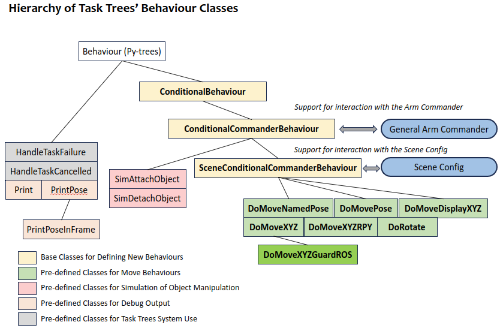

# Task Trees SDK: Extensible and Adaptable Behaviour Classes

The [py-trees](https://github.com/splintered-reality/py_trees) behaviour class extension package of the **Task Trees SDK** aims to ease the implementation of behaviour tree based robot arm manipulation. The behaviour classes in the package are based on class `py_trees.behaviour.Behaviour`, enabling seamless slot into a py-tree behaviour tree. The behaviour classes can be divided into three groups.

- **Move Behaviours**. The move behaviour classes can instruct a robot arm to execute various primitive movements. These classes have built-in connection to the [moveit](https://ros-planning.github.io/moveit_tutorials/) platform through the [arm commander](https://github.com/REF-RAS/arm_commander). Developers can exploit these existing classes to populate their behaviour trees.
- **Extensible Base Behaviours**. The extensible base behaviour classes comprise of built-in logic that deals with interaction with the underlying arm commander, and other typical components in a robot arm manipulation applications. Developers can use these functionally rich base classes to design custom behaviour classes.
- **Utility Behaviours**. The utility behaviour classes include those that support debugging of bahaviour trees and building a simulation application.  

The following figure describes all the behaviour classes and their dependencies in the extension package.

The extension package supports further specialization on the existing classes. For example, the move behaviour classes can form the basis for custom sensor-integration classes such as `DoMoveXYZGuardROS`. 

## Links

The descriptions of the three groups of behaviour classes can be found in their respective pages.

- [The Move Behaviours](BEHAVIOURS_MOVE.md)
- [The Base Behaviours](BEHAVIOURS_BASE.md)
- [The Utility Behaviours](BEHAVIOURS_UTILITY.md)

You can also go back to [README: Overview of the Task Trees SDK](README.md)

## Author

Dr Andrew Lui, Senior Research Engineer  
Robotics and Autonomous Systems, Research Engineering Facility  
Research Infrastructure  
Queensland University of Technology  

Latest update: Mar 2024
