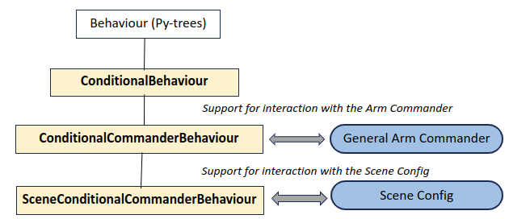
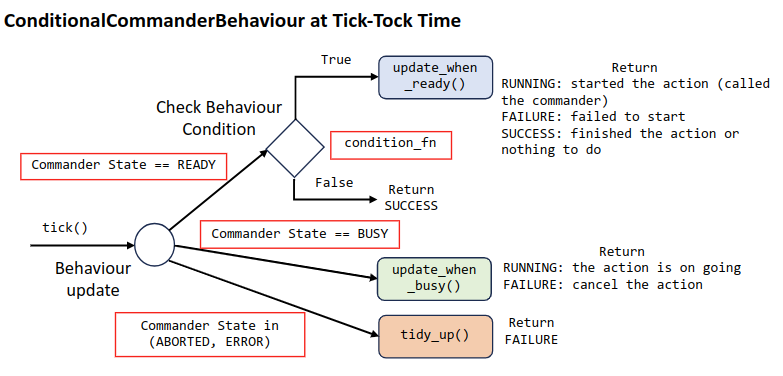
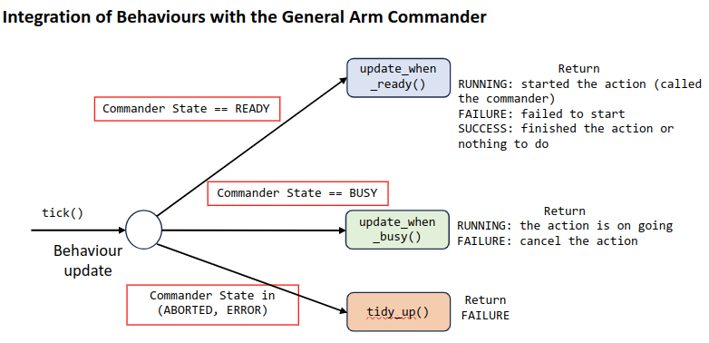

# Task Trees SDK: Extending the Base Behaviour Classes

The base behaviour classes in the extension behaviour package implements rich functionality for integration of custom behaviour classes with the arm commander, the task scene, and the task manager.

There are three base classes and their relation with each other and the py-tree `Behaviour` class is shown below.



## Class: task_trees.behavious_base.ConditionalBehaviour

The class `ConditionalBehaviour` is the base for specialized behaviours adopting the conditional behaviour notion. The condition_fn parameter is pre-processed at the class creation phase and converted into a form facilitating evaluation during the tick-tock phase. 
```
class ConditionalBehaviour(Behaviour): 
    SUCCESS_IF_FALSE = 0 
    FAILURE_IF_FALSE = 1 
    def __init__(self, name, condition_fn=True, condition_policy=ConditionalBehaviour.SUCCESS_IF_FALSE): 
        super(ConditionalBehaviour, self).__init__(name) 

    def preprocess_condition_fn():  
       .... 
    def is_condition_satisfied(): 
       ....  
```
The parameter `condition_policy` determines whether to return SUCCESS or FAILURE when the condition is False. The default value of `None` will make the `update` function returns according to the parent node. Returning SUCCESS is suitable for a Sequence parent with memory while FAILURE is for a Selector parent with memory.  

Subclasses of `ConditionalBehaviour` should override the function `update_if_true` and implement actions to take if `condition_fn` returns `True`.  The following describes the logic flow for the execution of `update_if_true`.


## Class: task_trees.behavious_base.ConditionalCommanderBehaviour

The class `ConditionalCommanderBehaviour` implements the common logic of a behaviour in dealing with the states of the arm commander.  The following shows the structure of the update function of ConditionalCommanderBehaviour. Subclasses of CommanderBehaviour will implement the three functions highlighted in the code snippet. 



The main job of the `update` or `update_if_true` function is to handle the different states of the arm commander. The following table summarizes the action taken according to the current arm commander state.

| Arm Commander State | Action to be Taken | Return Value |
| --- | --- | --- |
| READY | Call `update_when_ready` | The return value of the call is returned as the new behaviour status |
| BUSY | Call `update_when_busy` | The return value of the call is returned as the new behaviour status |
| SUCCEEDED | Call `tidy_up` | `SUCCESS` |
| ABORTED | Set the task's state to `ABORTED` and call `tidy_up` | `FAILURE` |
| ERROR | Set the task's state to `FAILED` and call `tidy_up` | `FAILURE` |

Subclasses of `ConditionalCommanderBehaviour` should override the function `update_if_ready`, and optionally override the functions `update_if_busy` and `tidy_up`. The function `update_if_ready` is where the arm commander is invoked. The function `update_if_busy` usually houses code for monitoring the progress including any alert to raise, such as an impending collision. The function `tidy_up` usually contains code for reset the arm commander to the previous configuration if something has been changed by this behaviour in `update_if_ready`. The following figure summarizes the above roles of the functions.



## Class: task_trees.behavious_base.SceneConditionalCommanderBehaviour

The class `ConditionalCommanderBehaviour` implements the process that converts logical positions and rotations of the task scene into physical positions and rotations. It uses the model provided throught the parameter `scene` for the necessary information for the conversion.

Custom behaviours that work at the logical scene level should subclass `ConditionalCommanderBehaviour`. 

## Links

- Go back to [Task Trees SDK: Extensible and Adaptable Behaviour Classes](BEHAVIOURS.md)
- Go back to [README: Overview of the Task Trees SDK](README.md)

## Author

Dr Andrew Lui, Senior Research Engineer <br />
Robotics and Autonomous Systems, Research Engineering Facility <br />
Research Infrastructure <br />
Queensland University of Technology <br />

Latest update: Mar 2024