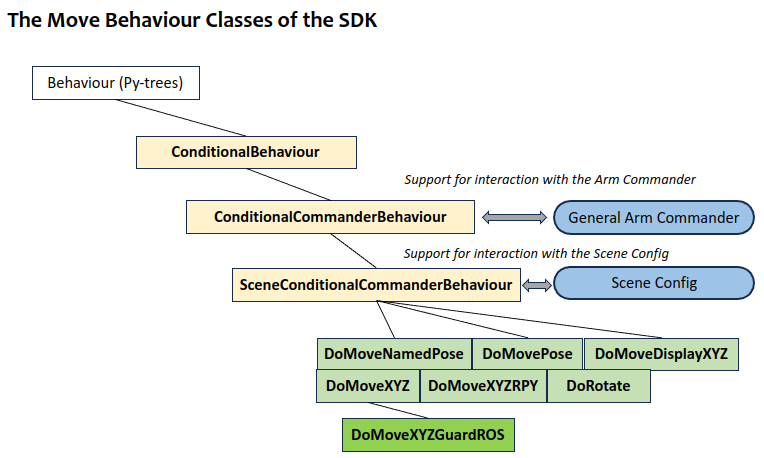
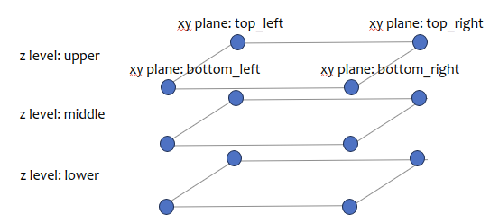
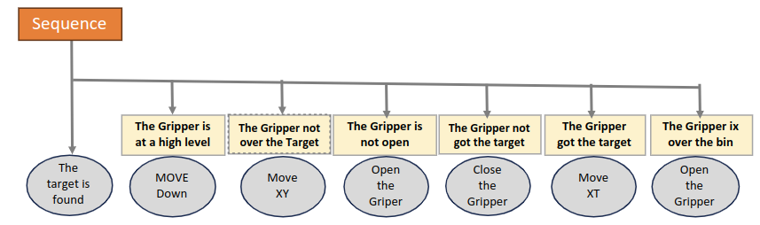
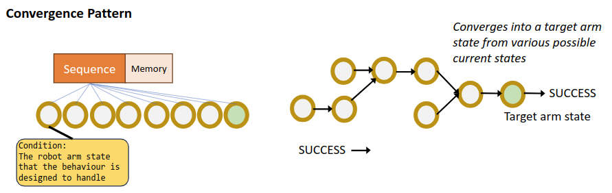
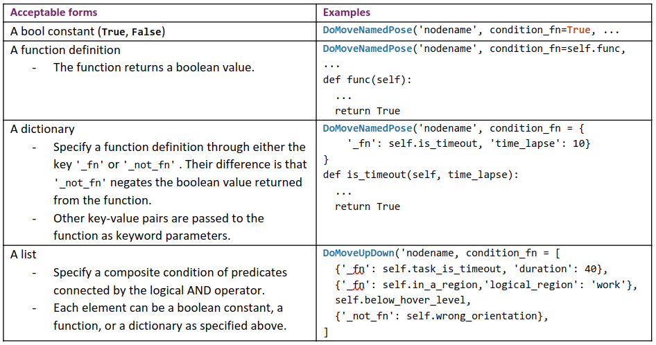

# Task Trees SDK: The Move Behaviour Classes

The move behaviour classes implement movement of the end-effector to a target pose. The target pose can be specified in various forms, such as the pose as a PoseStamped/Pose object, a list of 7 numbers (xyzqqqq) or 6 numbers (xyzrpy), only the position as a xyz list, only the rotation as a rpy list, and separated lists of xyz and rpy. The differentiation results in a number of move behaviour classes. Their relation to common base classes that support arm movement in a scene is outlined in the figure below.



The target pose parameter in the move behaviour classes generally accepts constants, logical names mapped to constants in the scene configuration file, and functions that returns a constant. The three forms represent physical binding, logical scene binding, and late binding of target poses respectively, providing developers flexiblily in designing the arm movement.

In addition, the list-typed target pose parameter supports **composition** of two or more parameter values into one, allowing each parameter value to contribute a part of the list. For example, a xyz list typed target pose can be composed from a first parameter value that specifies only the xy with z set to None, and the z value provided by a second parameter value. 

The move behaviour classes also support setting the target pose parameter in different reference frames, the parameter of which can be passed as a constant or a function. 

The following tabulates the move behaviour classes, the forms of acceptable target pose parameters and reference frames.

##### Module Name: task_trees.behaviours_move

| Class Name | Target Pose | Constant Binding | Logical Binding | Late Binding | Composition | Reference Frame |
| --- | --- | --- | --- | --- | --- | --- |
| DoMoveNamedPose | `named_pose` | No | Yes | No | No | No |
| DoMovePose | `target_pose` a list of 6 or 7 numbers, Pose/PoseStamped | Yes | No | No | No | Constant and Late Binding |
| DoMoveXYZ | `target_xyz` a xyz list | Yes | Yes | Yes | Yes | Yes |
| DoMoveXYZRPY | `target_xyz` a xyz list and `target_rpy` a rpy list | Yes | Yes | Yes | Yes | Constant and Late Binding |
| DoRotate | `target_rpy` a rpy list | Yes | Yes | Yes | Yes | Constant and Late Binding |
| DoMoveDisplaceXYZ | `dxyz` a list representing xyz displacement | Yes | Yes | Yes | Yes | Constant and Late Binding |

##### Module Name: task_trees.behaviours_move_sense

This class is a specialization of the `DoMoveXYZ` class, including move abortion based on sensor-based collision detection. 

| Class Name | Target Pose | Constant Binding | Logical Binding | Late Binding | Composition | Reference Frame |
| --- | --- | --- | --- | --- | --- | --- |
| DoMoveXYZGuardROS | `target_xyz` a xyz list | Yes | Yes | Yes | Yes | Yes |

#### Example: Late Binding

The following shows an example of using move behaviour classes as children in a Sequence node of a py-tree behaviour tree. The sequence moves the end-effector between a constant pose and a random generated xyz position. In the former, the binding of the `target_pose` parameter happens at the build time.  In the latter, the binding of the `target_xyz` is delayed until at the tick-tock time (i.e. late binding), offering developers opportunities to implement dynamic manipulations in functions more sophisicated than `self.generate_random_xyz`.

```
def generate_random_xyz(self) -> list:
    xyz = [random.uniform(0.1, 0.5), random.uniform(-0.3, 0.3), random.uniform(0.2, 0.6)]
    rospy.loginfo(f'generate_random_xyz: {xyz}')
    return xyz
...
def build_tree(self) -> Composite:
...
    move_branch = py_trees.composites.Sequence(
            'move_branch',
            memory=True,
            children=[
                DoMovePose('move_back', True, arm_commander=self.arm_commander, target_pose=[0.3, 0.0, 0.6, 3.14, 0, 0]),
                DoMoveXYZ('move_random_xyz', True, arm_commander=self.arm_commander, target_xyz=self generate_random_xyz),
                ],)
```

#### Example: Logical Binding 

The following shows an example of using logical position and rotation names as values for the parameter `target_xyz`.
```
    move_branch = py_trees.composites.Sequence(
            'move_branch',
            memory=True,
            children=[
                DoMoveXYZ('move_start', True, arm_commander=self.arm_commander, scene=self.the_scene, target_xyz='positions.start'), 
                DoMoveXYZ('move_end', True, arm_commander=self.arm_commander, scene=self.the_scene, target_xyz='positions.end'), 
                ],)
```
The parameter `scene` specify the scene configuration that defines the logical names. The following is the statement for loading the scene configuration from the file `task_scene_2.yaml`.
```
    self.the_scene = Scene(os.path.join(os.path.dirname(__file__), 'task_scene_2.yaml'))
```
The content of the file is shown below.
```
scene:
  named_poses: 
    stow: [0.0, -1.244, 0.0, -2.949, 0.0, 1.704, 0.785] # from base
    home: [0.0, -0.785, 0.0, -2.36, 0.0, 1.57, 0.785] # from base
  positions:
    start: [0.3, 0.0, 0.2]
    end: [0.3, 0.0, 0.6]
subscenes:
...
```
### Example: Composition of the Target Pose

A compositional target pose specification builds the parameter value from a list of pose items. 

The following example shows that the final xyz is composed from a logical position `positions.xy_start` that defines the x and y, and another logical position `positions.z_upper` that defines z. 
```
    DoMoveXYZ('move_start', True, arm_commander=self.arm_commander, scene=self.the_scene, 
        target_xyz=['positions.xy_start', 'positions.z_upper']), 
```
The definitions of the two logical position names are given below. 
```
scene:
  positions:
    xy_start: [0.2, 0.3, null]
    xy_mid: [0.25, 0.4, null]
    xy_end: [0.3, 0.6, null]
    z_upper: [null, null, 0.4]
    z_lower: [null, null, 0.2]
  rotations:
    alpha: [3.139, 0.0, -0.785]
subscenes:
```
The compositional list is processed from the front to the end or until all components are specified. The first item `positions.xy_start` has omitted the z component and therefore the second item is examined for the missing component. The final `target_xyz` is computed as `[0.2, 0.3, 0.4]`

Compositional specification enables the separation and remixing of positional and rotational components. The following figure illustrates how 7 partial position definitions can define 12 positions without redundency, making the specification resiience to change.



### Example: Move in Custom Reference Frames

The parameter `reference_frame` accepts both the frame name representing a constant string and a function that returns a constant string. The following examples shows two `DoMoveXYZ` behaviours moving to different physical positions, though the target position is the same [0, 0, 0].  The frame `area_1` and `area_2` respectively determine the binding to the physical positions. 
```
DoMoveXYZ('move_origin_area_1', True, arm_commander=self.arm_commander, target_xyz=[0, 0, 0], reference_frame='area_1'),
DoMoveXYZ('move_origin_area_1', True, arm_commander=self.arm_commander, target_xyz=[0, 0, 0], reference_frame='area_2')
```

The parameter `reference_frame` supports late binding as well. If the parameter value is a function definition, the reference frame is obtained when the move behaviour is actually executed.

#### More Examples

For other examples on target pose parameter composition and logical position and rotation names, please refer to the following tutorial pages.
- [Using the Extension Behaviour Classes in a behaviour tree of Py-Trees](pytrees_moves/TUT_MOVE_PYTREES.md)
- [Using the Extension Behaviour Classes with Scene Configuration and Custom Reference Frames](pytrees_moves_scene/TUT_MOVE_SCENE_PYTREES.md)

### Conditional Behaviours

The move behaviour classes are conditional behaviours, meaning that a condition function can be optionally passed as a parameter to the constructor. When the tick happens at the behaviour in a Sequence, a False returned from the condition function will considere the behaviour SUCCESS and the tick is moved to the next behaviour. This means the outcome of this behaviour is considered achieved and executing the behaviour is not needed. On the other hand, True condition will result in the execution of the behaviour. 

Building a behaviour subtree based on conditional behaviours can adapt a sequence of behaviours to different starting state of the robot arm. Because it enables selectively execute a list of behaviours in a Sequence (and Selector), some conditional behaviours can be added for different starting states moving to planned intermediate states.

Conditional behaviour classes have separated conditions from actions in behaviours. The following example shows a sequence of behaviours designed for pick-n-drop. The ovals are the actions to be taken if the associated condition, in a rectangle, is True. The second behaviour of which the action is _move down_ is required only if the gripper is located high up, which is specified as the condition. Examine the other conditional behaviours in the sequence and the conditions basically represent the inverse of the desirable outcome of the behaviours.  

#

#### Convergence Pattern

Conditional behaviour classes are pivotal in the implementation of the following convergence pattern of behaviour subtrees. A use case of this pattern is to bring different starting poses through appropriate intermediate poses and finally to converge into the same outcome. 

#

#### Acceptable Forms of Condition Function

The parameter `condition_fn` accepts many forms, which are described in the below table. 

#

The actual definitions of condition functions are usually defined in the task trees manager (i.e. a subclass) so that these functions have access to the other instance variables such as the `arm_commander`.

## Links

- Go back to [Task Trees SDK: Extensible and Adaptable Behaviour Classes](BEHAVIOURS.md)
- Go back to [README: Overview of the Task Trees SDK](README.md)

## Author

Dr Andrew Lui, Senior Research Engineer <br />
Robotics and Autonomous Systems, Research Engineering Facility <br />
Research Infrastructure <br />
Queensland University of Technology <br />

Latest update: Mar 2024
