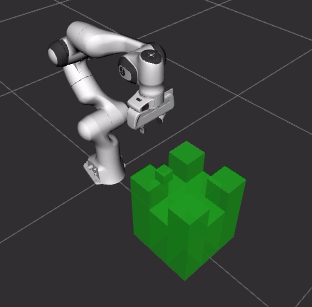

# Task Trees: SDK for Rapid Robot Arm Manipulation Application Development 

The **Task Trees** is a SDK designed to accelerate the development of behaviour-tree based robot arm manipulation applications. It is part of the model architecture for guiding the design of reusable and extensible robot arm manipulation applications.  The architecture also includes the **Arm Commander** [Github Repo](https://github.com/REF-RAS/arm_commander) as the interface to the underlying arm manipulation platform. 

The following figure shows the structure robot arm manipulation applications based on the task trees and the arm commander. The left-hand-side one represents a standalone application and the right-hand-side one simply has a ROS layer that separates the application logic from the task-level behaviour tree implementation.

Designing and implementation arm manipulation tasks is challenging because such a task spans across low-level arm movement planning (i.e. collision avoidance), scene management (specification of collision objects), semantic-level action planning and execution, exception handling, and interfacing with application logic. The **Task Trees**, supported by the **Arm Commander**, offers programming resources that address these issues with pre-fabricated elements working together in a generic structure.  The pre-fabricated elements are designed to be reusable and specializable, which significantly accelerate programming work. The **Task Trees** is implemented based on [py-trees](https://pypi.org/project/py-trees/), a popular Python behaviour tree module. Due to the compatibility, application developers always have the option of reverting to the available py-trees behaviours or defining their own.

# Components of the Task Trees SDK

The task trees SDK comprises the following components.

# Example: Push-Block Demo

The **Push-Block** demo program illustrates a robot arm moving a block between 4 side channels on a large block. 

The development time is around a couple of hours - and a significant part is programming the simulation. The behaviour tree part, with the suport of the **Task Trees** has taken less than an hour.

## Author

Dr Andrew Lui, Senior Research Engineer  
Robotics and Autonomous Systems, Research Engineering Facility  
Research Infrastructure  
Queensland University of Technology  

Latest update: Feb 2024
