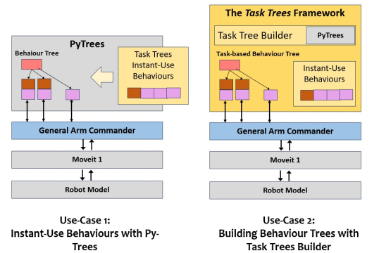

# The Task Trees Framework

 [](https://opensource.org/licenses/BSD-3-Clause)

**Robotics and Autonomous Systems Group, Research Engineering Facility, Research Infrastructure**
**Queensland University of Technology**

## Introduction

The **Task Trees Framework** is a Python programming module for accelerating the development of behaviour tree based robot manipulator applications. It uses the **Arm Commander** [Github Repo](https://github.com/REF-RAS/arm_commander) as the interface to command the robot manipulator. 


Use the [Documentation Entry Point](http://REF-RAS.github.io/task_trees) to bring you to following parts of the documentation of the task trees framework.
- Overview of the Task Trees Framework
- Installation Guide
- The Instant-Use Behaviours
- Logical Scene Configuration Support
- The Task Trees Managers
- Demonstration Programs
- Programming Guide to Instant-Use Behaviours in PyTrees 
- Programming Guide to Instant-Use Behaviours in Task Trees
- Programming Guide to Task Specification and Execution
- API Reference

## Programming with the Task Trees Framework

The task trees framework offers a rich set of concrete instant-use behaviours, behaviour tree templates and application programming interfaces that enables a developer to start experimenting and crafting robotic tasks in a shortened development cycle.

The task trees framework offers components that may be used individually or collectively. Though ROS is the enabling technology for the supporting software of the task trees, ROS programming is not required. The developers have a lot of flexibility of how to intergrate their applications with the task trees.

### Use Case 1: Instant-Use Move Behaviours with PyTrees

The task trees framework provides a comprehensive set of ready-to-use behaviours of motion. These behaviours are subclasses of `py_trees.behaviour` and therefore compatible with the popular behaviour tree framework [py-trees](https://pypi.org/project/py-trees/). A robotic manipulation application based on py-trees can exploit these instant-use behaviour classes and shorten development time. The example program [source code](./demos/pytrees_moves/simple_move_2.py) below uses the `DoMoveXYZ` class to move between two positions.
```
class SimpleMovePyTreesApplication():
    def __init__(self, arm_commander:GeneralCommander, spin_period_ms:int=10):
        self.arm_commander:GeneralCommander = arm_commander
        self.arm_commander.abort_move(wait=True)
        self.arm_commander.reset_world()
        self.arm_commander.wait_for_ready_to_move()

        self.root_sequence = self.create_move_branch()
        self.bt = BehaviourTree(self.root_sequence) 
        
        self.the_thread = threading.Thread(target=lambda: self.bt.tick_tock(period_ms=spin_period_ms), daemon=True)
        self.the_thread.start()  
    
    def create_move_branch(self) -> Composite:
        move_branch = Sequence ('move_branch', memory=True,
                children=[DoMoveXYZ('move_xyz', True, arm_commander=self.arm_commander, target_xyz=[0.3, 0.0, 0.2]), 
                          DoMoveXYZ('move_xyz', True, arm_commander=self.arm_commander, target_xyz=[0.3, 0.0, 0.6]), ],)
        return move_branch
```


### Use Case 2: Building Behaviour Trees with the Tree Builder

Developers may choose to utilize the behaviour tree templates offered by the task trees framework. As the below example demonstrates [source code](./demos/task_moves/estop_move.py), the `GuardedTaskTreesManager` supports building behaviour trees with an initialization branch, one or more priority branch, and a guard that can halt the behaviour tree with a stop condition.  The `EStopMoveTaskManager` is specialized with an initialization of moving to a __stow__ pose and a branch with a move-to-random-position behaviour. It connects the `estop_state` of the `EStop` class as the guard condition. The `EStop` class represents a stop button in a GUI that can trigger the `estop_state`. 

```
class EStopMoveTaskManager(GuardedTaskTreesManager):
    def __init__(self, arm_commander:GeneralCommander, spin_period_ms:int=10):
        super(EStopMoveTaskManager, self).__init__(arm_commander)

        self.arm_commander.abort_move(wait=True)
        self.arm_commander.reset_world()

        self._set_initialize_branch(self.create_init_branch())
        self._add_priority_branch(self.create_move_branch())      

        self._install_bt_and_spin(self.bt, spin_period_ms)

        self.estop = EStop()
        self.set_global_guard_condition_fn(lambda: not self.estop.get_estop_state())
        self.estop.gui_loop()
        
    def create_move_branch(self) -> Composite:
        move_branch = Sequence('move_branch', memory=True,
                children=[DoMoveXYZ('move_xyz', True, arm_commander=self.arm_commander, target_xyz=
                        lambda: [random.uniform(0.1, 0.5), random.uniform(-0.3, 0.3), random.uniform(0.2, 0.6)]),],)
        return move_branch
    
    def create_init_branch(self) -> Composite:
        init_branch = Sequence('init_branch', memory=True,
                children=[DoMoveJointPose('reset_pose', True, arm_commander=self.arm_commander, 
                                    target_joint_pose=[0.00, -1.243, 0.00, -2.949, 0.00, 1.704, 0.785],), ],)
        return init_branch  
```




### Use Case 3: Task-Level Coordination with the Task Trees Manager

Task-level management is the main feature of the task trees framework. A task is defined as a sequence of conditional behaviours that achieve an outcome. The `GuardedTaskTreesManager` and the vanilla companion `TaskTreesManager` supports the association of a behaviour sub-tree as a task and the managed execution of tasks. In the example below [source code](./demos/task_moves/task_move_1.py), the function call `_add_task_branch` associate a behaviour (of moving in a rectangular path) with the task class `MoveRectTask`.

```
class MoveRectTask(BasicTask):
    def __init__(self):
        super(MoveRectTask, self).__init__()

class SimpleTaskMoveManager(TaskTreesManager):
    def __init__(self, arm_commander:GeneralCommander, spin_period_ms:int=10):
        super(SimpleTaskMoveManager, self).__init__(arm_commander)

        self._set_initialize_branch(self.create_init_branch())
        self._add_task_branch(self.create_move_rect_branch(), MoveRectTask)

        self._install_bt_and_spin(self.bt, spin_period_ms)
        
    def create_move_rect_branch(self) -> Composite:
        move_branch = Sequence('move_branch', memory=True,
                children=[
                    DoMoveDisplaceXYZ('move_dy', True, arm_commander=self.arm_commander, dxyz=[0.0, 0.3, 0]), 
                    DoMoveDisplaceXYZ('move_dz', True, arm_commander=self.arm_commander, dxyz=[0, 0, 0.3]), 
                    DoMoveDisplaceXYZ('move_ndy', True, arm_commander=self.arm_commander, dxyz=[0, -0.3, 0]), 
                    DoMoveDisplaceXYZ('move_random_ndz', True, arm_commander=self.arm_commander, 
                      dxyz=lambda: [0.0, 0.0, random.uniform(-0.25, -0.35)]),],)
        return move_branch
    
    def create_init_branch(self) -> Composite:
        init_branch = Sequence('init_branch', memory=True,
                children=[DoMoveJointPose('reset_pose', True, arm_commander=self.arm_commander, 
                                    target_joint_pose=[0.00, -1.243, 0.00, -2.949, 0.00, 1.704, 0.785],), ],)
        return init_branch       
```
Call `submit_task()` to execute the task. This is an asynchronous call, enabling the use of `cancel_task()` to terminate the task, `wait_for_completion()` to block the execution until completion and 
```
        self.arm_commander = GeneralCommander('panda_arm')
        task_manager = SimpleTaskMoveManager(self.arm_commander)
        ...
        task_manager.submit_task(the_task:=MoveRectTask())
        the_task.wait_for_completion()    
```

### Use Case 4: Advanced Behaviour Trees

The task tree framework can ease development of advanced behaviours with flexible definition of reference frames. The demonstration at the start of the page simulates a robot arm moving a cubic block between four narrow side channels on a surface. There are 6 from-to pairs each of which normally requires a specific sequence of behaviours. 

Exploiting the symmetry in the behaviour sequences, moving the block from the current channel to one of the three other channels can be modelled as a single task of two major steps. The first step moves the block from exterior to interior part of the block, and the second step moves the block from interior to exterior.  

Refer to the [Design Notes on the PushBlock Demo](docs/source/DEMO_PUSHBLOCK.md) for more details.


## Developer

Dr Andrew Lui, Senior Research Engineer <br />
Robotics and Autonomous Systems, Research Engineering Facility <br />
Research Infrastructure <br />
Queensland University of Technology <br />

Latest update: Mar 2024
