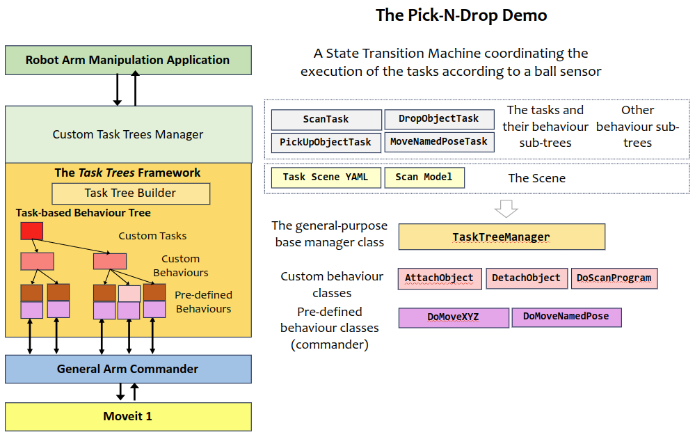
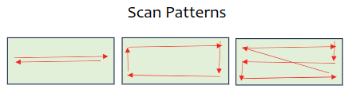
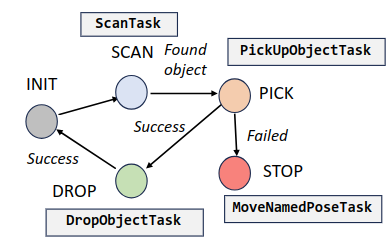

# Task Trees Demo: Pick-N-Drop

The pick-n-drop application simulates the operation of discovery of a sphere on a desktop, picking it up to disposing it to a bin. The operation will run indefinitely as the simulator creates new spheres at random locations.

This demo requires the Panda robot model.

## Running the Demo Program

Assume that the task trees and the arm commander packages are installed in a catkin_workspace. Refer to the [Installation Guide](https://github.com/REF-RAS/task_trees/docs/INSTALL.md)

- Change directory to the root of the catkin workspace, run `source devel/setup.bash`.
- Change directory to this demo folder, run `/usr/bin/python3 demo.py`.

## Application Design based on the Task Trees Architecture

## The Tasks

The application divides the operation into four tasks:
- The Scan task: hovering over the desktop in a scan pattern for an attached sensor to find and locate any sphere. The task will run indefintely until it is cancelled when a sphere is found.
- The Pick task: moving to a location right on top of the sphere, descending to a prescribed height, and attaching the sphere to the gripper.
- The Drop task: moving to an intermediate pose (the home pose), and then moving to a location on top of the bin, and detaching the sphere from the gripper.
- The Move Named Pose task: moving to a resting pose (the stow pose).

### Pre-Defined Behaviours Used

- DoMoveNamedPose: Moves to a named pose as defined in the task scene
- DoMoveXYZ: Moves to a target position (xyz)

### Custom Behaviours Developed

- DoScanProgram (based on ConditionalCommanderBehaviour): Hovers to the next location of a scan line pattern that covers an area.
- SimGrabObject (based on py_trees.behaviour.Behavior): Simulates the grabbing of the sphere.
- SimDropObject (based on py_trees.behaviour.Behavior): Simulates the releasing of the grabbed sphere.
 
### The Behaviour Sub-Trees for the Tasks

#### The Scan Task

| Behaviour Classes | Conditions | Parameters | Remarks |
| --------- | ------- | ------ | ------- |
| DoMoveNamedPose | is in the inner region | the `home` pose | move to home pose first if in inner region |
| DoMoveXYZ | is at home pose | the composition of the `start` and `scan_z_level` position | move to the starting position |
| DoScanProgram |  | The next position provided by the scan model | Decorated by SuccessIsRunning|  

#### The PickUpObject Task

| Behaviour Classes | Conditions | Parameters | Remarks |
| --------- | ------- | ------ | ------- |
| DoMoveXYZ | | a prescribed height above the sphere | move to above object|
| DoMoveXYZ | | the grab position | descend to object |
| SimAttachObject |  |  |  |  

#### The DropObject Task

| Behaviour Classes | Conditions | Parameters | Remarks |
| --------- | ------- | ------ | ------- |
| DoMoveNamedPose | is in the inner region | the `home` pose | move home first if in inner region|
| DoMoveXYZ | | the `drop` position | descend to object |
| SimDetachObject |  |  |  | 

#### The MoveNamedPose Task

| Behaviour Classes | Conditions | Parameters | Remarks |
| --------- | ------- | ------ | ------- |
| DoMoveNamedPose | is not in the inner region | the `home` pose | move home first if not in inner region|
| DoMoveNamedPose | | the target named pose | |
                        
### The Scan Pattern

The scan pattern can be customized. The following are some of the possible patterns.

## The Demo Application

The demo application uses the following state transition machine to determine which task is to be submitted to the task manager for execution. 

In the SCAN state, the application monitors results from the sensor. If a sphere is found, the application cancels the ScanTask and jumps to the PICK state. 

## The Program Files
- `task_trees_manager_pnd.py`: defines the custom task manager, behaviour sub-trees for every task and the tasks. 
- `behaviours_pnd.py`: defines the custom behaviours.
- `demo.py`: implements the application and its state transition machine.
- `scan_model`: implements the custom scan patterns for the ScanTask.
- `task_scene.yaml`: defines the positions and regions

## Links

- Go back to [Demo Program Catalogue](../DEMO_PROGRAMS.md)
- Go back to [README: Overview of the Task Trees SDK](README.md)

## Author

Dr Andrew Lui, Senior Research Engineer  
Robotics and Autonomous Systems, Research Engineering Facility  
Research Infrastructure  
Queensland University of Technology  

Latest update: Mar 2024