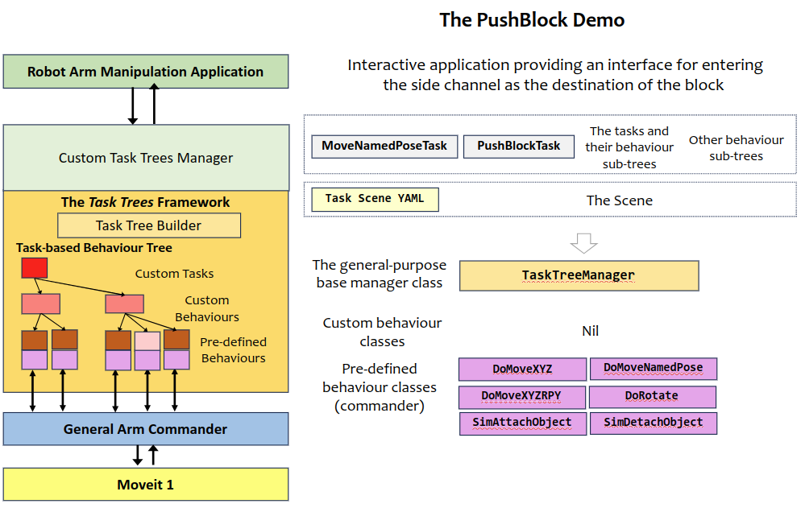
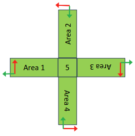

# Task Trees Demo: Push-Block

The push-block application simulates a block being moved between 4 side channels involving the end-effector moving into the cavities. The application operates interactively, receiving the target side channel as the destination of the block. The interactive mode can be replaced with the destination randomly drawn.

This demo requires the Panda robot model.

## Running the Demo Program

Assume that the task trees and the arm commander packages are installed in a catkin_workspace. Refer to the [Installation Guide](https://github.com/REF-RAS/task_trees/docs/INSTALL.md)

- Change directory to the root of the catkin workspace, run `source devel/setup.bash`.
- Change directory to this demo folder, run `/usr/bin/python3 demo.py`.

## Application Design based on the Task Trees Architecture

## The Tasks

The application divides the operation into two tasks:
- The PushBlock task: moving to the exterior side of the block and pushing it to the central zone. Then moving to another pose (both position and orientation) for pushing to the target channel if necessary, and finally pushing it to the target side channel. 
- The MoveNamedPose task: moving to a resting pose (the home pose).

### Pre-Defined Behaviours Used

- DoMoveNamedPose: Moves to a named pose as defined in the task scene
- DoMoveXYZ: Moves to a target position (xyz)
- DoMoveXYZRPY: Moves to a target pose (xyzrpy)
- DoRotate: Rotates to a target orientation (rpy)
- SimAttachObject: Simulates the attaching of an object to the end-effector.
- SimAttachObject: Simulates the detaching of an object from the end-effector.

### Custom Behaviours Developed

No custom behaviour is needed
 
### The Behaviour Sub-Trees for the Tasks

#### The PushBlock Task

The PushBlock task has a sequence of behaviours that pushes the block from the current side channel to a target side channel. There are 4 side channels labelled Area 1 to 4 as shown in the following figure.

The behaviour subtree has exploited the symmetry in the problem, which can be summarized to the following:
- Push the block from the exterior side of the current channel to the interior side and the shared area between the channels.
- Push the block from the interior side of the target channel to the exterior side.

For example, moving a block from area 1 to area 4 can be achieved by defining reference frames for each area and the following procedure:
- Push the block from the exterior side of area 1 to the interior side and the shared area between the channels.
- Push the block from the interior side of area 4 to the exterior side of area 4.

Note the above figure for the positive x direction (red) and the positive y direction (green) for each area reference frame. So the exterior side is positive y direction and the interior side is negative y direction.

The support for multiple reference frames in the SDK has eliminated the need for different behaviour trees for every (current, target) pair.

| Behaviour Classes | Conditions | Parameters | Reference Frame | Remarks |
| --------- | ------- | ------ | ------- | ------- |
| DoMoveNamedPose | is in the inner region | the `home` pose | | move to home pose first if in inner region |
| DoMoveXYZ | if object not in area 5 | the composition of the `start` and `hover` position | current area | move to the transition position |
| DoRotate | if object not in area 5 | The right rotation for the current area  | | current area | rotate for descending into the channel |
| DoMoveXYZ | if object not in area 5| The `down` position  | current area | move down into the channel |
| SimAttachObject | if object not in area 5|  |   | touch and attach the object |
| DoMoveXYZ | if object not in area 5 | The `centre` position  | current area | push the object to the centre area |
| SimDetachObject |  |  |  | detach the object |
| DoMoveXYZ | if wrong pose for the second push | The `hover` position  | current area | move up if the wrong pose for the second push |
| DoMoveXYZRPY | if wrong pose for the second push | the composition of the `start` and `hover` position  and the right rotation for the target area | target area | align pose for the second push |
| DoMoveXYZ | if at `hover` position| The `down` position  | target area | move down if at hover pose |
| SimAttachObject |  |   |   | touch and attach the object |
| DoMoveXYZ |  | The `end` position  | target area | push the object to the target area |  
| SimDetachObject |  |  |  | detach the object |
| DoMoveXYZ |  | The `hover` position  | target area | move up | 
                    
#### The MoveNamedPose Task

| Behaviour Classes | Conditions | Parameters | Remarks |
| --------- | ------- | ------ | ------- |
| DoMoveNamedPose | is not in the inner region | the `home` pose | move home first if not in inner region|
| DoMoveNamedPose | | the target named pose | |

### The Behaviour Sub-Trees for Initialization

The initialization sub-tree runs only once right at the beginning. It moves the end-effector back to the stow pose after a series of safe intermediate poses. 

| Behaviour Classes | Conditions | Parameters | Remarks |
| --------- | ------- | ------ | ------- |
| DoMoveNamedPose | | the named pose `home`| move home |

## The Demo Application

The demo application implements a loop with getting the target area from the input and issuing a PushBlock task with the target area as the attribute. 

## The Program Files
- `task_trees_manager_pushblock.py`: defines the custom task manager, behaviour sub-trees for every task and the tasks. 
- `demo.py`: implements the application and the loop with interactive input and random target generation.
- `task_scene.yaml`: defines the positions and regions used in the application.

## Links

- Go back to [Demo Program Catalogue](../DEMO_PROGRAMS.md)
- Go back to [README: Overview of the Task Trees SDK](README.md)

## Author

Dr Andrew Lui, Senior Research Engineer  
Robotics and Autonomous Systems, Research Engineering Facility  
Research Infrastructure  
Queensland University of Technology  

Latest update: Mar 2024