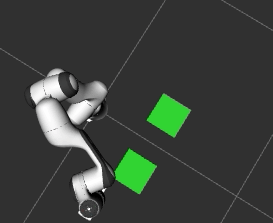

# Task Trees Tutorials: Using Scene Configuration on the Move Behaviour Classes on Py-Trees

This tutorials illustrates how to use scene configuration to enrich the target pose parameter with logical scene names.

This demo requires the Panda robot model.

## Running the Demo Program

Assume that the task trees and the arm commander packages are installed in a catkin_workspace. Refer to the [Installation Guide](https://github.com/REF-RAS/task_trees/docs/INSTALL.md)

- Change directory to the root of the catkin workspace, run `source devel/setup.bash`.
- Change directory to this demo folder, run one of the demo programs such as  `/usr/bin/python3 move_scene_1.py`.

## Example 1: Loading Named Poses from a Scene Config File

The program `move_scene_1.py` is an extension of the simple move programs in the `pytrees_move` folder. The new additions are the loading the of scene yaml file into the `Scene` object, and using the `Scene` object to load the named poses into the arm commander.

```
...
    def __init__(self, arm_commander:GeneralCommander, spin_period_ms:int=10):
        # setup the robotic manipulation platform through the commander
        self.arm_commander:GeneralCommander = arm_commander
        self.arm_commander.abort_move(wait=True)
        self.arm_commander.reset_world()
        self.arm_commander.wait_for_ready_to_move()

        # load the scene configuration
        self.the_scene = Scene(os.path.join(os.path.dirname(__file__), 'task_scene.yaml'))
        # setup name poses
        self.named_poses = self.the_scene.keys_config('named_poses')
        for pose_name in self.named_poses:
            pose_name = 'named_poses.' + pose_name
            self.arm_commander.add_named_pose(pose_name, self.the_scene.query_config(pose_name))

        # build the behaviour tree
        self.root_sequence = self.create_move_branch()
        self.bt = BehaviourTree(self.root_sequence) 
        py_trees.display.render_dot_tree(self.bt.root)
        # spin the tree
        self.the_thread = threading.Thread(target=lambda: self.bt.tick_tock(period_ms=spin_period_ms), daemon=True)
        self.the_thread.start()   
```
The function `create_move_branch` is given below, which moves between two defined named poses `home` and `stow`.
```
    def create_move_branch(self) -> Composite:

        move_branch = py_trees.composites.Sequence(
                'move_branch',
                memory=True,
                children=[
                    DoMoveNamedPose('move_to_stow', True, arm_commander=self.arm_commander, scene=self.the_scene, named_pose='named_poses.stow'),
                    DoMoveNamedPose('move_to_homw', True, arm_commander=self.arm_commander, scene=self.the_scene, named_pose='named_poses.home'),                     
                    ],
        )
        return move_branch
```
The named poses are defined in the file `task_scene.yaml`.
```
scene:
  named_poses: 
    stow: [0.0, -1.244, 0.0, -2.949, 0.0, 1.704, 0.785] # from base
    home: [0.0, -0.785, 0.0, -2.36, 0.0, 1.57, 0.785] # from base
    
subscenes:
```
Note that the bare minimal scene file contains the `scene` branch and the `subscenes` branch.

## Example 2: Logical Positions

The program `move_scene_2.py` defines target positions with logical scene names.

Two position logical names are used in the construction of `DoMoveXYZ`, namely `positions.start` and `positions.end`, in the function `create_move_branch`.
```
    def create_move_branch(self) -> Composite:

        move_branch = py_trees.composites.Sequence(
                'move_branch',
                memory=True,
                children=[
                    DoMoveXYZ('move_start', True, arm_commander=self.arm_commander, scene=self.the_scene, target_xyz='positions.start'), 
                    DoMoveXYZ('move_end', True, arm_commander=self.arm_commander, scene=self.the_scene, target_xyz='positions.end'), 
                    ],
        )
        return move_branch
```
The two logical position names are defined in the file `task_scene_2.yaml`
```
scene:
  named_poses: 
    stow: [0.0, -1.244, 0.0, -2.949, 0.0, 1.704, 0.785] # from base
    home: [0.0, -0.785, 0.0, -2.36, 0.0, 1.57, 0.785] # from base
  positions:
    start: [0.3, 0.0, 0.2]
    end: [0.3, 0.0, 0.6]
subscenes:
```

## Example 3: Logical Positions and Rotations with Open Values

The program `move_scene_3.py` defines target positions and rotations with logical scene names, and also using `null` in the scene definition file to indicate open values.

Position and rotation logical names are used in the construction of `DoMoveXYZRPY` in the move branch of the behaviour tree.

```
    def create_move_branch(self) -> Composite:

        move_branch = py_trees.composites.Sequence(
                'move_branch',
                memory=True,
                children=[
                    DoMoveXYZRPY('move_xyzrpy', True, arm_commander=self.arm_commander, 
                                scene=self.the_scene,
                                 target_xyz=['positions.default_x', self.generate_random_xyz],
                                 target_rpy=self.generate_random_rpy), 
                    ],
        )
        return move_branch
```
Note that the definition of the logical name `positions.default_x` contains the `null` value. The value indicates that this component is not defined and left open for other lower rank values to fill, which is what the composition list for the parmaeter `target_xyz` has speicified.
The content of `task_scene_3.yaml`
```
scene:
  named_poses: 
    stow: [0.0, -1.244, 0.0, -2.949, 0.0, 1.704, 0.785] # from base
    home: [0.0, -0.785, 0.0, -2.36, 0.0, 1.57, 0.785] # from base
  positions:
    default_x: [0.3, null, null]
    init: [0.307, 0.0, 0.588]
  rotations:
    alpha: [3.139, 0.0, -0.785]
subscenes:
```

## Example 4: Movements in Local Subscene with Reference Frames

The program `move_scene_4.py` illustrates how to define local scenes with reference frames based on collision objects. Here, the collision objects are defined purely for the purpose of specifying a reference frame.

The yaml file `task_scene_y.yaml` has defined two collision objects of the shape `box` and size 0.2 x 0.2 x 0.01. The frame `area_1` is located at [0.4, 0.2, 0.0] and the frame `area_2` is located at [0.4, -0.2, 0.0]. 
```
scene:
  named_poses: 
    home: [0.0, -0.785, 0.0, -2.36, 0.0, 1.57, 0.785] # from base
  positions:
    default_z: [null, null, 0.5]
  objects:
    - name: area_1
      type: box
      model_file: null
      dimensions: [0.2, 0.2, 0.01]
      xyz: [0.4, 0.20, 0.00]
      rpy: [0, 0, 3.14]
    - name: area_2
      type: box
      model_file: null
      dimensions: [0.2, 0.2, 0.01]
      xyz: [0.4, -0.20, 0.00]
      rpy: [0, 0, 3.14]
subscenes:
```
The function `create_move_branch` defines a branch that moves to a random location in `area_1` reference frame 5 times, and then to a random location in `area_2` five times. The z component of the `target_xyz` is set to `position.default_z` in the scene configuration file.
```
    def create_move_branch(self) -> Composite:

        move_branch = py_trees.composites.Sequence(
                'move_branch',
                memory=True,
                children=[
                    py_trees.decorators.Repeat('repeat_move_xy', child=DoMoveXYZ('move_xy', True, arm_commander=self.arm_commander, scene=self.the_scene, 
                        target_xyz=['positions.default_z', self.generate_random_xyz], reference_frame='area_1'), 
                        num_success=5),
                    py_trees.decorators.Repeat('repeat_move_xy', child=DoMoveXYZ('move_xy', True, arm_commander=self.arm_commander, scene=self.the_scene, 
                        target_xyz=['positions.default_z', self.generate_random_xyz], reference_frame='area_2'), 
                        num_success=5),                    
                    ],
        )
        return move_branch
```



## Example 5: Late Binding Reference Frames

The program `move_scene_5.py` has only one different from `move_scene_4.py`, which is passing a function as the reference frame parameter. The function `generate_random_frame` returns
either `area_1` or `area_2`, so that the robot is randomly switch between the work areas.
```
    def generate_random_frame(self) -> list:
        if random.random() < 0.5:
            return 'area_1'
        else:
            return 'area_2'
```
Note that the behaviour construction has the above function passed as the parameter.
```
   def create_move_branch(self) -> Composite:
   
        move_branch = py_trees.composites.Sequence(
                'move_branch',
                memory=True,
                children=[
                    py_trees.decorators.Repeat('repeat_move_xy', child=DoMoveXYZ('move_xy', True, arm_commander=self.arm_commander, scene=self.the_scene, 
                        target_xyz=['positions.default_z', self.generate_random_xyz], reference_frame=self.generate_random_frame), 
                        num_success=5),
                    py_trees.decorators.Repeat('repeat_move_xy', child=DoMoveXYZ('move_xy', True, arm_commander=self.arm_commander, scene=self.the_scene, 
                        target_xyz=['positions.default_z', self.generate_random_xyz], reference_frame=self.generate_random_frame), 
                        num_success=5),                    
                    ],
        )
        return move_branch
```
## Links

- Go back to [Demo Program Catalogue](../DEMO_PROGRAMS.md)
- Go back to [README: Overview of the Task Trees SDK](README.md)

## Author

Dr Andrew Lui, Senior Research Engineer <br />
Robotics and Autonomous Systems, Research Engineering Facility <br />
Research Infrastructure <br />
Queensland University of Technology <br />

Latest update: Mar 2024