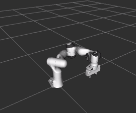
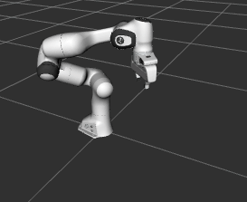

# Task Trees Tutorials: Using Move Behaviour Classes in the Task Trees Framework

This tutorials illustrates examples of using the move behaviour classes for building behaviour trees based on the **Task Trees** framework.

The task trees framework reduces the complexity in building behaviour trees by providing a skeleton behaviour tree and functions for operating the tree with ease.

This demo requires the Panda robot model.

## Running the Demo Program

Assume that the task trees and the arm commander packages are installed in a catkin_workspace. Refer to the [Installation Guide](https://github.com/REF-RAS/task_trees/docs/INSTALL.md)

- Change directory to the root of the catkin workspace, run `source devel/setup.bash`.
- Change directory to this demo folder, run one of the demo programs such as  `/usr/bin/python3 simple_move_1.py`.

## Example 1: The Minimal Program

The program `simple_move_1.py` illustrates a small program that build the simplest behaviour tree and populate it with a move behaviour class.

The following is the common constructor for the series of demo programs. The class is based on the `TaskTreeManager`, which is the baseline framework class. 

It setups the arm commander, creates a branch and stick the branch to the framework through the function `_add_priority_branch`. Finally, the function `_install_bt_and_spin` is called to run the behaviour tree.
```
class SimpleMoveApplication(TaskTreesManager):

    def __init__(self, arm_commander:GeneralCommander, spin_period_ms:int=10):
        super(SimpleMoveApplication, self).__init__(arm_commander)

        # setup the robotic manipulation platform through the commander
        self.arm_commander.abort_move(wait=True)
        self.arm_commander.reset_world()

        # build and install the behavior tree
        self._add_priority_branch(self.create_move_branch())
        
        # install and unleash the behaviour tree
        self._install_bt_and_spin(self.bt, spin_period_ms)
```
The function `create_move_branch` is given below, which creates a Sequence of one behaviour.
```
    def create_move_branch(self) -> Composite:

        move_branch = py_trees.composites.Sequence(
                'move_branch',
                memory=True,
                children=[
                    DoMoveXYZ('move_xyz', True, arm_commander=self.arm_commander, target_xyz=[0.3, 0.0, 0.6]), 
                ],
        )
        return move_branch
```
It passes a constant to the `target_xyz` parameter, which moves the end-effector to xyz = [0.3, 0.0, 0.6] in the default reference frame.

## Example 2: Two Behaviours in a Sequence

The program `simple_move_2.py` defines a sequence with two behaviours.
```
    def create_move_branch(self) -> Composite:

        move_branch = py_trees.composites.Sequence(
                'move_branch',
                memory=True,
                children=[
                    DoMoveXYZ('move_xyz', True, arm_commander=self.arm_commander, target_xyz=[0.3, 0.0, 0.2]), 
                    DoMoveXYZ('move_xyz', True, arm_commander=self.arm_commander, target_xyz=[0.3, 0.0, 0.6]), 
                    ],)
        return move_branch
```

## Example 3: Late Binding of the Target XYZ

The program `simple_move_3.py` shows how the class `DoMoveXYZ` can accept a function so that the target xyz is determined at the tick-tock time.
```
    def create_move_branch(self) -> Composite:

        move_branch = py_trees.composites.Sequence(
                'move_branch',
                memory=True,
                children=[
                    DoMoveXYZ('move_xyz', True, arm_commander=self.arm_commander, target_xyz=self.generate_random_xyz), 
                    ],)
        return move_branch
```
The function `self.generate_random_xyz` is listed below. It returns a xyz list with each of the three components randomly generated.
```
    def generate_random_xyz(self) -> list:
        xyz = [random.uniform(0.1, 0.5), random.uniform(-0.3, 0.3), random.uniform(0.2, 0.6)]
        rospy.loginfo(f'generate_random_xyz: {xyz}')
        return xyz
```


## Example 4: Two Sequence Branches and the class `DoMoveXYZRPY`

The program `simple_move_4.py` shows a behaviour tree with two sequence branches. It also demonstrates how separating the target position and orientation in the class `DoMoveXYZRPY` enables finer movement control.

The constructor has included code that creates two branches.
```
        ...
        # build the behaviour tree
        self.move_branch = self.create_move_branch()
        self.init_branch = self.create_init_branch()
        self.init_branch = py_trees.decorators.OneShot('init_oneshot_branch', policy = py_trees.common.OneShotPolicy.ON_COMPLETION, child=self.init_branch)
    
        self.root_sequence = py_trees.composites.Sequence('root_sequence', memory=True, children=[
            self.init_branch,
            self.move_branch,
            ])
```
The function `create_init_branch`.
```
    def create_init_branch(self) -> Composite:
        init_branch = py_trees.composites.Sequence(
                'init_branch',
                memory=True,
                children=[
                    DoMoveXYZRPY('reset_pose', True, arm_commander=self.arm_commander, target_xyz=[0.307, 0.0, 0.588],
                                 target_rpy=[3.139, 0.0, -0.785]), 
                    ],)
        return init_branch  
```
The function `create_move_branch`. Note that the parameter `target_xyz` is a compositional list. The first value specifies only x = 0.3 but leaves the y and z open. The second value provides a random y and a random z. The x component of the second value is ignored because x is already specified by the first value.
```
    def create_move_branch(self) -> Composite:
        move_branch = py_trees.composites.Sequence(
                'move_branch',
                memory=True,
                children=[
                    DoMoveXYZRPY('move_xyzrpy', True, arm_commander=self.arm_commander, 
                                 target_xyz=[[0.3, None, None], self.generate_random_xyz],
                                 target_rpy=self.generate_random_rpy), 
                    ],
        )
        return move_branch
```
The following table explains the composition of the parameter `target_xyz`.

| The Rank | The Value | Composition of the Target XYZ | Remarks |
| --- | --- | --- | --- |
| 0 |   | `[None, None, None]` | |
| 1 | `[0.3, None, None]` | `[0.3, None, None]` | |
| 2 | self.generate_random_xyz |  `[0.3, ry, rz]` | Assume the function returns [rx, ry, rz] |




## Example 5: More Complex Trees and the class `DoMoveDisplaceXYZ`

The program `simple_move_5.py` shows a more complex move branch, which utilizes also the `Repeat` decorator from py-trees. It defines a movement along the four sides of a rectangle. The sequence is moving right, up, left, and down, each side is divided into 5 steps.

```
    def create_move_branch(self) -> Composite:

        move_branch = py_trees.composites.Sequence(
                'move_branch',
                memory=True,
                children=[
                    py_trees.decorators.Repeat('repeat_move_dy', child=DoMoveDisplaceXYZ('move_dy', True, arm_commander=self.arm_commander, dxyz=[0.0, 0.05, 0]), 
                        num_success=5),
                    py_trees.decorators.Repeat('repeat_move_dz', child=DoMoveDisplaceXYZ('move_dz', True, arm_commander=self.arm_commander, dxyz=[0, 0, 0.05]), 
                        num_success=5),
                    py_trees.decorators.Repeat('repeat_move_ndy', child=DoMoveDisplaceXYZ('move_ndy', True, arm_commander=self.arm_commander, dxyz=[0, -0.05, 0]), 
                        num_success=5),
                    py_trees.decorators.Repeat('repeat_move_ndz', child=DoMoveDisplaceXYZ('move_random_ndz', True, arm_commander=self.arm_commander, dxyz=self.generate_random_dxyz), 
                        num_success=5),                    
                    ],
        )
        return move_branch
```


## Links

- Go back to [Demo Program Catelogue](../DEMO_PROGRAMS.md)
- Go back to [README: Overview of the Task Trees SDK](README.md)

## Author

Dr Andrew Lui, Senior Research Engineer <br />
Robotics and Autonomous Systems, Research Engineering Facility <br />
Research Infrastructure <br />
Queensland University of Technology <br />

Latest update: Mar 2024