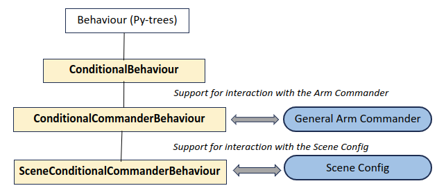
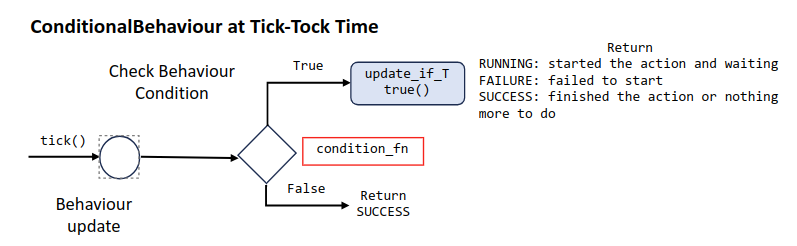
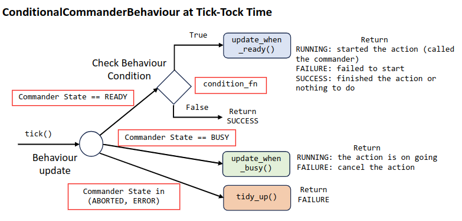
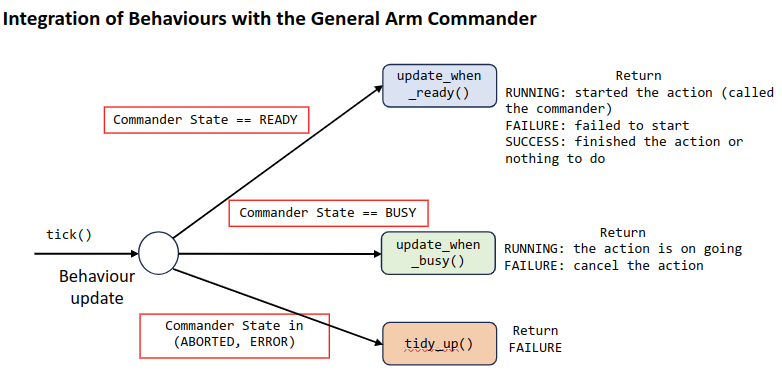

# Develop Custom Behaviours

The IUB classes have inherited significant functionality from the three base classes of the task trees framework, namely, `ConditionalBehaviour`, `ConditionalCommanderBehaviour`, and `SceneConditionalCommanderBehaviour`. The py-tree class `py_trees.behaviour.Behaviour`is their common ancestor. 



- `ConditionalBehaviour` inherits from `Behaviour` and adds conditional execution, which determines whether the behaviour needs execution at ticking. 
- `ConditionalCommanderBehaviour` inherits from `ConditionalBehaviour` and adds the capability of moving the robot manipulator through the arm commander.
- `SceneConditionalCommanderBehaviour` inherits from `ConditionalCommanderBehaviour` and adds the capability of logical scene binding according to a scene configuration.


## Class: task_trees.behavious_base.ConditionalBehaviour

The class `ConditionalBehaviour` is the base for specialized behaviours adopting the conditional behaviour notion. The condition_fn parameter is pre-processed at the class creation phase and converted into a form facilitating evaluation during the tick-tock phase. 
```
class ConditionalBehaviour(Behaviour): 
    SUCCESS_IF_FALSE = 0 
    FAILURE_IF_FALSE = 1 
    def __init__(self, name, condition_fn=True, condition_policy=ConditionalBehaviour.SUCCESS_IF_FALSE): 
        super(ConditionalBehaviour, self).__init__(name) 

    def preprocess_condition_fn():  
       .... 
    def is_condition_satisfied(): 
       ....  
```
The parameter `condition_policy` determines whether to return SUCCESS or FAILURE when the condition is False. The default value of `None` will make the `update` function returns according to the parent node. Returning SUCCESS is suitable for a Sequence parent with memory while FAILURE is for a Selector parent with memory.  

Subclasses of `ConditionalBehaviour` should override the function `update_if_true` and implement actions to take if `condition_fn` returns `True`.  The following describes the logic flow for the execution of `update_if_true`.




## Class: task_trees.behavious_base.ConditionalCommanderBehaviour

The class `ConditionalCommanderBehaviour` implements the common logic of a behaviour in dealing with the states of the arm commander.  The following shows the structure of the update function of ConditionalCommanderBehaviour. Subclasses of CommanderBehaviour will implement the three functions highlighted in the code snippet. 



The main job of the `update` or `update_if_true` function is to handle the different states of the arm commander. The following table summarizes the action taken according to the current arm commander state.

| Arm Commander State | Action to be Taken | Return Value |
| --- | --- | --- |
| READY | Call `update_when_ready` | The return value of the call is returned as the new behaviour status |
| BUSY | Call `update_when_busy` | The return value of the call is returned as the new behaviour status |
| SUCCEEDED | Call `tidy_up` | `SUCCESS` |
| ABORTED | Set the task's state to `ABORTED` and call `tidy_up` | `FAILURE` |
| ERROR | Set the task's state to `FAILED` and call `tidy_up` | `FAILURE` |

Subclasses of `ConditionalCommanderBehaviour` should override the function `update_if_ready`, and optionally override the functions `update_if_busy` and `tidy_up`. The function `update_if_ready` is where the arm commander is invoked. The function `update_if_busy` usually houses code for monitoring the progress including any alert to raise, such as an impending collision. The function `tidy_up` usually contains code for reset the arm commander to the previous configuration if something has been changed by this behaviour in `update_if_ready`. The following figure summarizes the above roles of the functions.




### Example: DoMoveJointPose

The `DoMoveJointPose` IUB class is an example subclass of `ConditionalCommanderBehaviour`
```
class DoMoveJointPose(ConditionalCommanderBehaviour):

    def __init__(self, name, condition_fn=True, condition_policy=None, arm_commander=None, target_joint_pose=None):
        super(DoMoveJointPose, self).__init__(name=name, condition_fn=condition_fn, condition_policy=condition_policy, arm_commander=arm_commander)
        ...
        self.joint_pose = target_joint_pose

    def update_when_ready(self):
        # obtain the named pose, and if it is a function, call the function to get the string
        joint_pose = self.joint_pose
        if hasattr(joint_pose, '__call__'):
            joint_pose = joint_pose()
        # validate the named_pose
        if joint_pose is None or type(joint_pose) != list:
            logger.error(f'DoMoveJointPose ({self.name}): invalid joint pose "{joint_pose}" parameter')
            return Status.FAILURE
        # send the command to the General Commander in an asynchronous manner
        self.arm_commander.move_to_joint_pose(joint_pose, wait=False)        
        return Status.RUNNING
```
Notes:
- The implementation `update_when_ready` is executed when the condition function (`condition_fn`) returns True and the arm commander is in the `READY` state at the ticking of the behaviour instance.
- The `self.joint_pose` instance variable supports physical and dynamic binding, which is determined by its type. If `self.joint_pose` is a function reference, then a function call is made to resolve the physical joint values.
- Issue the move command by passing the physical joint values through the arm commander's `move_to_joint_pose` function.
- Return `Status.RUNNING` to set the behaviour in the RUNNING status. 
- From now on, the base class `ConditionalCommanderBehaviour` will take over the follow-up management of the move command, querying the arm commander for whether the commander is switched to a completion state. It will then change the behaviour to `Status.SUCCESS` or `Status.FAILURE` according to the outcome of the command. This is transparent to the developer of `DoMoveJointPose`

## Class: task_trees.behavious_base.SceneConditionalCommanderBehaviour

The class `ConditionalCommanderBehaviour` implements the resolution of logical positions and rotations of the task scene into physical positions and rotations. It uses the model provided throught the parameter `scene` for the necessary information for the conversion.

Custom move behaviours that work at the logical scene level should subclass `ConditionalCommanderBehaviour`. 

### Example: DoMoveNamedPose

The `DoRotate` IUB class is an example subclass of `SceneConditionalCommanderBehaviour`. It accepts a move target that is utimately resolvesd into a rotation in the rpy format.

```
class DoRotate(SceneConditionalCommanderBehaviour):   
    def __init__(self, name, condition_fn, condition_policy=None, arm_commander=None, scene=None, target_rpy=None, reference_frame=None):
        super(DoRotate, self).__init__(name=name, condition_fn=condition_fn, condition_policy=condition_policy, 
                                       arm_commander=arm_commander, scene=scene, reference_frame=reference_frame)
        if target_rpy is None:
            logger.error(f'{__class__.__name__} ({self.name}): parameter (target_rpy) is None -> fix the missing value at behaviour construction')
            raise AssertionError(f'A parameter should not be None nor missing') 
        if scene is None:
            logger.warning(f'{__class__.__name__} ({self.name}): no scene model is provided -> acceptable if logical pose is not involved in this behaviour') 
        self.target_rpy = target_rpy

    def update_when_ready(self):
        # evaluate physical target rpy
        if self.the_scene is None:
            target_rpy = self.compute_physical_target(self.target_rpy)      
        else:
            target_rpy = self.compute_physical_target(self.target_rpy, self.the_scene.query_rotation_as_rpy)

        if self.target_rpy is None or target_rpy is None:
            logger.error(f'DoRotate ({self.name}): invalid target_rpy parameter {self.target_rpy}')
            return Status.FAILURE 

        # send the command to the General Commander in an asynchronous manner  
        binded_reference_frame = self._bind_reference_frame(self.reference_frame)
        logger.info(f'DoRotate ({self.name}): started rotate to orientation: {target_rpy} in reference frame "{binded_reference_frame}"')          
        self.arm_commander.rotate_to_orientation(roll=target_rpy[0], pitch=target_rpy[1], yaw=target_rpy[2], reference_frame=binded_reference_frame, wait=False)
        return Status.RUNNING
```
Notes:
- The `self.compute_physical_target` is a function of `SceneConditionalCommanderBehaviour` that performs the resolution of the `target_rpy` parameter using logical binding or dynamic binding if needed.
- The constructor of `SceneConditionalCommanderBehaviour` requires a `scene` object, which is the scene configuration for logical binding.
- The class `DoRotate` however is designed to accommodate the situation where no scene configuration is provided, hence the if-else structure in the function `update_when_ready`. If a `scene` object is not given, the class does not support logical binding.


### Author

Dr Andrew Lui, Senior Research Engineer <br />
Robotics and Autonomous Systems, Research Engineering Facility <br />
Research Infrastructure <br />
Queensland University of Technology <br />

Latest update: Mar 2024