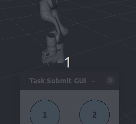

# Catalogue of Demo Programs and Tutorials

This page provides a list of the demo programs and programming tutorials for the **Task Trees** framework.

## List of Demo Programs and Tutorials

The following table summarizes the features of each major demo programs or program suites in the `/demo` folder.

| Folder | Name | Application Programming Model | Remarks |
| --- | --- | ---- | ---- |
| gridscan | Pattern Scan in a Grid | Standalone, procedural, non-interactive | |
| pickndrop | Pick N Drop | Standalone, state transition machine | Repeat indefintely |
| pickndrop_estop | Pick N Drop with Estop | Standalone, state transition machine | Pressing EStop aborting all behaviours and the task, EStop as a separate ROS node |
| pushblock | Push a Block between Channels | Standalone, loop with interactive input | Repeat indefintely |
| pushblock_ros | Push a Block between Channels with ROS Client | ROS Server-Client, loop with interactive input in the client | Using ROS Action Goal |

The following demo programs based on only the pre-defined behaviour classes of the task tree SDK and the py_trees Python behaviour trees module.

| Folder | Name | Application Programming Model | Remarks |
| --- | --- | ---- | ---- |
| pytrees_move | Simple movements | Standalone, procedural, repeat indefinitely | Based on PyTrees |
| pytrees_move_scene | Simple movements with logical scene definitions | Standalone, procedural, repeat indefinitely | Based on PyTrees |

The following demo programs based on the task tree manager class `TaskTreesManager` and pre-defined behaviour classes of the task tree SDK.

| Folder | Name | Application Programming Model | Remarks |
| --- | --- | ---- | ---- |
| simple_move | Simple movements | Standalone, procedural, repeat indefinitely | Based on `TaskTreesManager` |
| simple_move_scene | Simple movements with logical scene definitions | Standalone, procedural, repeat indefinitely | Based on `TaskTreesManager` |
| task_moves | Task based movement | Standalone, procedural, repeat indefinitely | Based on `TaskTreesManager` |

## Overview of the Demo Programs

### Pattern Scan in a Grid (gridscan)

The gridscan application simulates the operation of an end-effector working over a grid surface inside a shallow tank. The end-effector moves between grid cells inside the tank according to a program and moves back to a home pose. During the operation, the end-effector changes the orientation while moving to different parts ot the tank.

Go to [README of the Demo Program](DEMO_GRIDSCAN.md)

### Pick N Drop (pickndrop)

The pick-n-drop application simulates the operation of discovery of a sphere on a desktop, picking it up to disposing it to a bin. The operation will run indefinitely as the simulator creates new spheres at random locations.

Go to [README of the Demo Program](DEMO_GRIDSCAN.md)

### Pick N Drop with Estop (pickndrop_estop)

This demo program is an extension of the pick-n-drop application that simulates the operation of discovery of a sphere on a desktop, picking it up to disposing it to a bin. It shows how to use the `GuardedTaskTreesManager` to implement a guard triggered by an EStop button.

Go to [README of the Demo Program](DEMO_PICKNDROP_ESTOP.md)

### Push a Block between Channels (pushblock)

The push-block application simulates a block being moved between 4 side channels involving the end-effector moving into the cavities. The application operates interactively, receiving the target side channel as the destination of the block. The interactive mode can be replaced with the destination randomly drawn.

Go to [README of the Demo Program](DEMO_PUSHBLOCK.md)

### Push a Block between Channels with ROS Client (pushblock_ros)

This demo program is an extension of the push-block application that simulates a block being moved between 4 side channels involving the end-effector moving into the cavities. The application is now restructured as a client-server ROS design. 

Go to [README of the Demo Program](DEMO_PUSHBLOCK.md)

## Programming Tutorials

### Py-Trees 

- [Tutorial: Instant-Use Move Behaviours with PyTrees](TUT_MOVE_PYTREES.md)
- [# Tutorial: Instant-Use Move Behaviours with PyTrees and Logical Scene](TUT_MOVE_SCENE_PYTREES.md)

### Task Trees

- [Tutorial: Instant-Use Move Behaviours with Task Trees](TUT_MOVE_TASKTREES.md)
- [Tutorial: Instant-Use Move Behaviours, Task Trees, and Logical Scene](TUT_MOVE_SCENE_TASKTREES.md)
- [Tutorial: Tasks Specification and Execution with Task Trees Manager](TUT_TASK_MOVE_TASKTREES.md)

_Demo Animation of the Task Move 4 Example_ 

