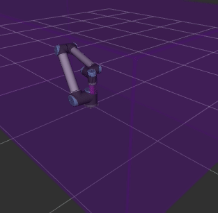
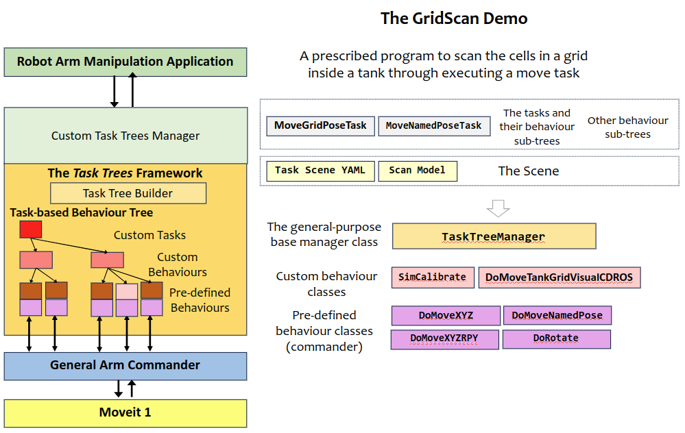
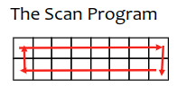

# Design Notes: GridScan Demo

The gridscan application simulates the operation of an end-effector working over a grid surface inside a shallow tank. The end-effector moves between grid cells inside the tank according to a program and moves back to a home pose. During the operation, the end-effector changes the orientation while moving to different parts ot the tank.



This demo requires the UR10 robot model.

[Source Code](https://github.com/REF-RAS/task_trees/tree/main/demos/gridscan)

## Running the Demo Program

Assume that the task trees and the arm commander packages are installed in a catkin_workspace. Refer to the [Installation Guide](INSTALL.md)

- Change directory to the root of the catkin workspace, run `source devel/setup.bash`.
- Change directory to this demo folder, run `/usr/bin/python3 demo.py`.

## Application Design based on the Task Trees Architecture



## The Tasks

The application divides the operation into two tasks:
- The MovePose task: moving to a prescribed grid cell inside the tank in a sequence of movement that involves coming up and down, rotation, and traversal. 
- The Move Named Pose task: moving to a resting pose (the stow pose).

### Pre-Defined Behaviours Used

- DoMoveNamedPose: Moves to a named pose as defined in the task scene
- DoMoveXYZ: Moves to a target position (xyz)
- DoMoveXYZRPY: Moves to a target pose (xyzrpy)
- DoRotate: Rotates to a target orientation (rpy)

### Custom Behaviours Developed

- DoMoveTankGridVisualCDROS (based on DoMoveTankGrid): DoMoveTankGrid and DoMoveTankGridVisualCDROS are both custom behaviour class for this applcation. They moves to a prescribed cell in the tank. DoMoveTankGridVisualCDROS has the additional feature of aborting the movement when a range finder sends an collision alert.
- SimCalibrate (based on py_trees.behaviour.Behavior): Simulates the hand-eye calibration and the location of the tank related to the robot.
 
### The Behaviour Sub-Trees for the Tasks

#### The MovePose Task

The MovePose task has a sequence of behaviours that are catered for different current pose of the end-effector. The behaviours will move the end-effector through a series of intermediate poses safely to the target pose dependent on the current pose.

| Behaviour Classes | Conditions | Parameters | Remarks |
| --------- | ------- | ------ | ------- |
| DoMoveNamedPose | is in the inner region | the `home` pose | move to home pose first if in inner region |
| DoMoveTankGridVisualCDROS | is at home pose | the composition of the `transition` and `hover` position | move to the transition position |
| DoMoveXYZ | wrong orientation and inside the tank | The `hover` position  | move up if wrong orientation with a rotation constraint |
| DoMoveTankGridVisualCDROS | wrong orientation and above the tank | The `transition` position  | move to the transition position |
| DoRotate | wrong orientation and above the tank | The `gamma` rotation  | rotate to the gamma rotation |
| DoRotate | wrong orientation and above the tank | The rotation of the target cell  | rotate according to the target cell |
| DoMoveTankGridVisualCDROS | wrong xy | The xy position of the target cell  | move to the target cell |
| DoRotate | not at `delta` angle and above the tank |  The `delta` rotation  | set oblique angle before moving down |
| DoMoveXYZRPY | at `delta` angle and above the tank | The `submerged` position  | move down into the tank |      


#### The MoveNamedPose Task

| Behaviour Classes | Conditions | Parameters | Remarks |
| --------- | ------- | ------ | ------- |
| DoMoveNamedPose | is not in the inner region | the `home` pose | move home first if not in inner region|
| DoMoveNamedPose | | the target named pose | |

### The Behaviour Sub-Trees for Catching the No-Tank Situation

A behaviour sub-tree is placed before the MovePose Task sub-tree for catching the situation that the tank has not been discovered. The MovePose Task is only relevant when the position of the tank is known.

If there is no tank discovered, the sub-tree returns SUCCESS and therefore the next sub-tree, which is of MovePose, is not executed.

### The Behaviour Sub-Trees for Initialization

The initialization sub-tree runs only once right at the beginning. It moves the end-effector back to the stow pose after a series of safe intermediate poses. 

| Behaviour Classes | Conditions | Parameters | Remarks |
| --------- | ------- | ------ | ------- |
| DoMoveXYZ | inside the tank and in the grid | the `hover` position | move up if inside tank|
| DoMoveNamedPose | over the tank and in the grid | the named pose `home`| move home |
| DoMoveNamedPose | in the inner region | the named pose `stow` | move stow if at home | 

### The Behaviour Sub-Trees for Timeout

The timeout sub-tree has high priority than the task branches. The sequence of behaviour is similar to that in the initialization.

| Behaviour Classes | Conditions | Parameters | Remarks |
| --------- | ------- | ------ | ------- |
| DoMoveXYZ | timeout, inside the tank and in the grid | the `hover` position | move up if timeout and inside tank|
| DoMoveNamedPose | timeout, over the tank and in the grid | the named pose `home`| move home if timeout |
| DoMoveNamedPose | timeout and in the inner region | the named pose `stow` | move stow if at home | 

## The Demo Application

The following shows the psuedo code of the demo application. 
```
Submit MoveNamedPose(stow) task 
Submit Calibrate task

Loop through global grid cell (x, y) where x, y in the set of cell indices
    compute the grid cell coordinate (tx, ty, cx, cy)
    Submit MovePose(tx, ty, cx, cy) 
```

The application has a prescribed work program driven by the loop, which is illustrated below. The scan pattern can be customized. 



## The Program Files
- `task_trees_manager_gridscan.py`: defines the custom task tree manager, behaviour sub-trees for every task and the tasks. 
- `behaviours_gridscan.py`: defines custom behaviours.
- `behaviours_advanced.py`: defines an advanced custom behaviour.
- `demo.py`: implements the application and its state transition machine.
- `task_scan_gridscan`: implements the scan program.
- `task_scene.yaml`: defines the positions and regions

### Author

Dr Andrew Lui, Senior Research Engineer <br />
Robotics and Autonomous Systems, Research Engineering Facility <br />
Research Infrastructure <br />
Queensland University of Technology <br />

Latest update: Mar 2024