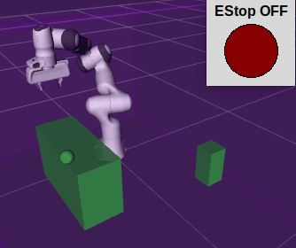
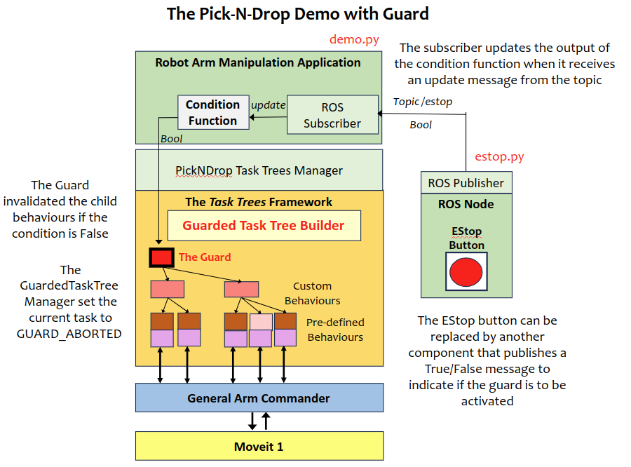

# Design Notes: Pick-N-Drop with EStop Guard Demo

This demo program is an extension of the pick-n-drop application that simulates the operation of discovery of a sphere on a desktop, picking it up to disposing it to a bin. It shows how to use the `GuardedTaskTreesManager` to implement a guard triggered by an EStop button.

This demo program is based on the [PickNDrop Demo](DEMO_PICKNDROP.md). The content covers the extended part only.



This demo requires the Panda robot model.

[Source Code](https://github.com/REF-RAS/task_trees/tree/main/demos//pickndrop_estop)

## Running the Demo Program

### Installation of Tkinter

The emergency stop button simulator is a GUI that runs on the graphics module by John Zelle and Tkinter. The latter requires the following installation step.

```
sudo apt install python3-tk
```

Assume that the task trees and the arm commander packages are installed in a catkin_workspace. Refer to the [Installation Guide](INSTALL.md)

- Change directory to the root of the catkin workspace, run `source devel/setup.bash`.
- Change directory to this demo folder, run `/usr/bin/python3 demo.py`.
- Run the simulated estop button `/usr/bin/python3 estop.py`.

## Application Design based on the Task Trees Architecture



### The Class GuardedTaskTreesManager

The class `GuardedTaskTreesManager` is an extension to `TaskTreesManager`. The additional feature is the provision of guards that can invalidate a behaviour tree according to a condition. This feature can accelerate the addition of safety features such as a soft emergency stop or sensor-based collision detector. The class `GuardedTaskTreesManager` provides two guards:
- The global guard that invalidates the whole behaviour tree
- The task guard that invalidates only the task branches. The initialization and the priorty branches are not protected.

### The Extension Work

The extension to the PickNDrop demo requires minimal effort.
- Changed the base class for `PnDTaskTreesManager` from `TaskTreesManager` to `GuardedTaskTreesManager` (in task_trees_manager_pnd.py).
- Create a simulator of a soft emergency stop button as a ROS node (estop.py). The node publishes the state of the button as a boolean value to the topic `/estop`.
- Create a subscriber in the application (demo.py) that receives the state of the button and updates an instance variable in the application class `GuardedPNDTaskManagerDemo`.
- Create a function `estop_guard_condition` in the application `GuardedPNDTaskManagerDemo` (demo.py) that relays the estop status variable to the Guard.
- Pass the function to the PickNDrop Task TreeManager through `set_global_guard_condition`.

### Impact on the State Transition Machine

An activated guard will invalidate the behaviours under the guard and set the current task to `TaskStates.GUARD_ABORTED`. The state transition machine that drives the PickNDrop application considers all errors and aborts in the task as a condition of switching to the STOP state. 

Note that if the emergency stop button is disengaged, the guards in the task tree manager will remain activated because the parameter `guard_reset` is defaulted to True. This is reasonable for the situation of estop induced events as recovery procedures are likely to be required before the task tree manager can resume.

### Recovery from Guard Activation

A coding example of guard activation is given below, which is the handling code for the STOP state in the state transition machine. 

Replace the first coding snippet in `demo.py` with the second (revised version).

The original version.
```
            elif state == DemoStates.STOP:
                logger.info(f'=== PickNDrop STOP')   
                if the_task is not None and the_task.get_state() == TaskStates.GUARD_ABORTED:
                    logger.warning(f'Aborted by the EStop -> unable to resume because there is no built-in recovery') 
                return  
```
The revised version.
```
            elif state == DemoStates.STOP:
                logger.info(f'=== PickNDrop STOP')   
                if the_task is not None and the_task.get_state() == TaskStates.GUARD_ABORTED:
                    logger.warning(f'Aborted by the EStop -> waiting for the reset of the task tree manager') 

                time.sleep(3.0) # wait for a few seconds to simulate the recovery

                logger.warning(f'Attempt to recover -> release the E-Stop button')       
                while True:
                    if self.estop_status == False:
                        break
                    time.sleep(1.0)
                logger.info(f'Reset the guard of the task tree manager') 
                self.the_task_manager.reset_guard()
                if self.the_blackboard.attached_object:
                    task_manager.submit_task(the_task := DropObjectTask())                    
                    state = DemoStates.DROP
                else:                   
                    state = DemoStates.INIT      
```

Tbe file `demo_recovery.py` contains this version of the STOP state handling. The while loop traps the execution until the EStop button is released. The guard of the task tree manager is then reset before going either to the DROP state (if an object is attached) or the INIT state (start over again).

### Acknowledgement

The `graphics.py` file is open-source written by John Zelle for use with the book "Python Programming: An
Introduction to Computer Science" (Franklin, Beedle & Associates). 

### Author

Dr Andrew Lui, Senior Research Engineer <br />
Robotics and Autonomous Systems, Research Engineering Facility <br />
Research Infrastructure <br />
Queensland University of Technology <br />

Latest update: Mar 2024