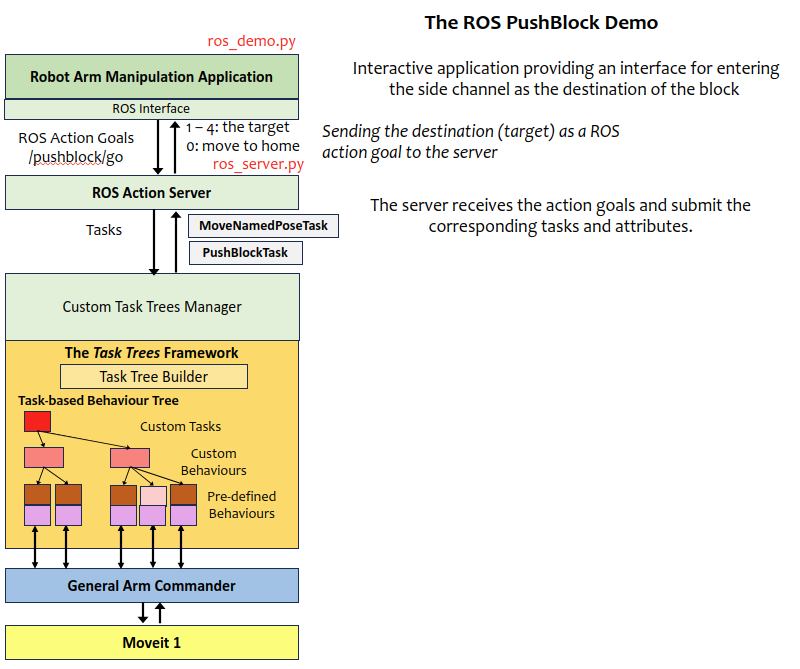

# Design Notes: Push-Block on ROS Demo

This demo program is an extension of the push-block application that simulates a block being moved between 4 side channels involving the end-effector moving into the cavities. The application is now restructured as a client-server ROS design. 

This demo program is based on the [Push-Block Demo](DEMO_PUSHBLOCK.md). The content covers the extended part only.


This demo requires the Panda robot model.

[Source Code](https://github.com/REF-RAS/task_trees/tree/main/demos/pushblock_ros)

## Running the Demo Program

Assume that the task trees and the arm commander packages are installed in a catkin_workspace. Refer to the [Installation Guide](INSTALL.md)

- Change directory to the root of the catkin workspace, run `source devel/setup.bash`.
- Change directory to this demo folder, run the ROS server first `/usr/bin/python3 ros_server.py`.
- Then run the ROS client application `/usr/bin/python3 ros_demo.py`.

## Application Design based on the Task Trees Architecture



The majority of the application logic is now moved to the client ROS application (ros_demo.py). The key difference is sending ROS action goals to the ROS server instead of submitting tasks to the task trees manager. 

The ROS server (ros_server.py) implements a hand-over mechanism, which receives goals from the clients and submit the corresponding tasks to the task trees manager.

### The ROS action 

The `TaskAction` is defined as follows.
```
### GOAL DEFINITION
int8 target
---
### RESULT DEFINITION
string data
---
### FEEDBACK DEFINITION
string data
```

The ROS server is listening at `/pushblock/go` for incoming goals. The `target` is an integer, and the range from 1 to 4 represents the destination area, and 0 represents moving to the home pose. 

## The Program Files
- `task_trees_manager_pushblock.py`: defines the custom task trees manager, behaviour sub-trees for every task and the tasks. 
- `ros_server.py`: implements the ROS action goal server, which receives a goal, submits the corresponding task, and handles goal abort and result return. 
- `ros_demo.py`: implements the loop with interactive input, random target generation, and code for calling the ROS action goal server.
- `task_scene.yaml`: defines the positions and regions used in the application.

### Author

Dr Andrew Lui, Senior Research Engineer <br />
Robotics and Autonomous Systems, Research Engineering Facility <br />
Research Infrastructure <br />
Queensland University of Technology <br />

Latest update: Mar 2024