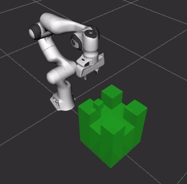

# Installation Guide
 [](https://opensource.org/licenses/BSD-3-Clause)

This repository has package the **Task Trees** as a ROS 1 package, which can be cloned into the `src` folder of a catkin workspace. The following shows how to satisfy the software requirements on which the task trees is based.

## Software Requirements
The SDK runs in an environment with the following components:
- Ubuntu 20.04
- Python 3.8 or above
- ROS Noetic with RViz
- Moveit for ROS Noetic
- Pytree 2.2.3
- The [arm_commander](https://github.com/REF-RAS/arm_commander) package
- UR10 Configuration and/or Panda Configuration (for the demo programs)

## Installation (Docker)

The Dockerfile for building the environment is in the root directory of this repository. It has been tested in Ubuntu 20.04. Download the file to your local disk and change directory to where the file is located. 
```
docker build --tag task_trees - < Dockerfile
```
The image building may take some time. When the build is completed, execute the following to check if the image `task_trees` is there.
```
docker image ls
```
Execute below to allow RViz in the container to display a GUI on the host.
```
xhost +
```
Start a container based on the image.
```
docker run -it --net=host \
    --env="DISPLAY" \
    --env="QT_X11_NO_MITSHM=1" \
    --volume="/tmp/.X11-unix:/tmp/.X11-unix:rw" task_trees
```
Inside the container, start the panda robot arm model in RViz
```
roslaunch panda_moveit_config demo.launch
```
Then execute the demo program.
```
cd ~/arm_commander_ws
source devel/setup.bash
rosrun task_trees demo.py
```

## Installation (Non-Docker)

### Install Moveit 

The non-docker method assumes the starting point of having ROS Noetic installed. 

```
sudo apt-get update
sudo apt-get install ros-noetic-moveit -y
```

### Install the Arm Commander and Task Trees

Create a catkin workspace.
```
mkdir -p ~/arm_commander_ws/src
cd ~/arm_commander_ws/src
```

Clone the arm commander repository to the `src` directory.
```
git clone git@github.com:REF-RAS/arm_commander.git
```

Clone this repository to the `src` directory.
```
git clone git@github.com:REF-RAS/task_trees.git
```

### Install a Robot Arm Model

The demo program and the tutorial programs are designed to work with the dimension of a Panda.

```
cd ~/arm_commander_ws/src
git clone https://github.com/ros-planning/panda_moveit_config.git -b noetic-devel 
```

### Build the Packages

```
rosdep install --from-paths src --ignore-src -r -y --rosdistro noetic
source /opt/ros/noetic/setup.bash
catkin_make -DPYTHON_EXECUTABLE=/usr/bin/python3
```

## Demonstration Programs

A number of [demo programs](../../demos/__init__.py) are located under `demos/` for testing the installation.

To execute the `push_block` demo, for example, the following scripts will bring up a RViz with Panda and the demo program.
```
roslaunch panda_moveit_config demo.launch

cd ~/arm_commander_ws
source devel/setup.bash
/usr/bin/python3 ./src/task_trees/demos/pushblock/demo.py
```



### Author

Dr Andrew Lui, Senior Research Engineer <br />
Robotics and Autonomous Systems, Research Engineering Facility <br />
Research Infrastructure <br />
Queensland University of Technology <br />

Latest update: Feb 2024
