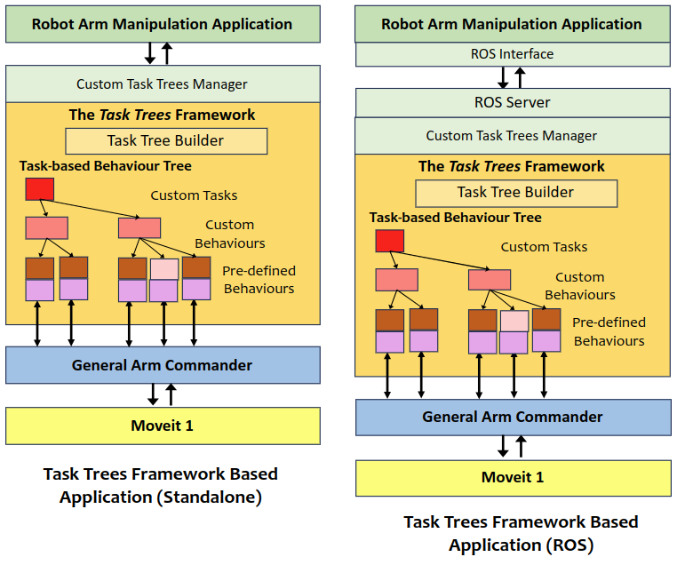

# An Overview

The **Task Trees** is a behaviour tree based SDK designed for accelerating the development of robot manipulator applications. It is based on the **Arm Commander** ([Github Repo](https://github.com/REF-RAS/arm_commander)) as the interface to the underlying arm manipulation platform. These two packages are the major components of the model architecture for guiding the design of reusable and extensible robot manipulator applications.

## Overview of the Task Trees SDK 

The Task Tree SDK aims to address the challenges in the modelling high level tasks as actionable, reactive, and reusable plans of robotic motions. 

Applications based on the task trees SDK share the same architecture and 

A robot arm manipulation applications 

The structure of robot arm manipulation applications based on the task trees framework and the arm commander. The left-hand-side one represents a standalone application and the right-hand-side one simply has a ROS layer that separates the application logic from the task-level behaviour tree implementation.

Designing and implementation arm manipulation tasks is challenging because such a task spans across low-level arm movement planning (i.e. collision avoidance), scene management (specification of collision objects), semantic-level action planning and execution, exception handling, and interfacing with application logic. 

The **Task Trees SDK**, supported by the **Arm Commander**, addresses the challenge with several programming resources. It adopts [py-trees](https://pypi.org/project/py-trees/), a popular Python behaviour tree module, as the basis and is therefore compatible with systems based on py-trees. 

The task is the most significant concept in the architecture. It represents a sequence of behaviours to achieve an outcome, and at the implementation level it is in the form of a guarded sub-tree in the behaviour tree. The ticking of the sub-tree happens only when the behaviour tree is given the corresponding task to execute.  
The Task Tree SDK comprises the following programming resources.

- [Extension package of py-tree based behaviour classes for arm manipulation](BEHAVIOURS.md). The package includes ready-to-use behaviour classes for robot arm manipulation and functionally rich base classes for creating custom behaviours.
- [Task-based Behaviour trees builder and manager](TASK_TREES_MANAGER.md). The tree builder is a behaviour tree framework that is structured to handle task-based behaviour subtrees and ordinary py-tree based subtrees.  
- [Scene configuration utilities](SCENE_SUPPORT.md). These utilities defines the structure of configuration files, the application programming interface to access the configurations, and the basis for developing custom logical to physical scene conversions. 

## Installation

Refer to the [Installation Guide](INSTALL.md).

## Example: the Push-Block Demo

The [Push-Block Demo Program](DEMO_PUSHBLOCK.md) simulates a robot arm moving a block between 4 side channels on an elevated surface. 

Moving the block from the current location to one of the three other channels is considered as one task, though there are totally six start-end combinations and also the possibility of the block left in the centre. Check out the implementation to find out how structured and concise it is of the demo program. Essentially, the Task Trees SDK supports the following features in the demo program that significantly accelerate the development. 
- Using the pre-built move behaviour classes of the extension package instead of coding the robot manipulation in custom behaviour classes.
- Using conditional behaviours for handling the robot arm in anomalous states (such as left in the centre) in the task subtree instead of coding additional subtrees for anomaly handling.
- Using custom reference frames to exploit the symmetry in the set of block movements, which eliminates the need to develop a subtree dedicated to one start-end movement.
- Using the task trees builder to add task subtrees and other prioritized behaviour subtrees, which eliminates the need to build the whole behaviour tree.
- Delegating operations of the behaviour tree and lifecycle management of submitted tasks to the task trees manager.

## Demo Programs and Programming Tutorials

This package includes many demo programs and examples for illustrating the capability of the SDK and how to program behaviour trees with the programming resources of the SDK. 

- Go to the [Demo Program and Programming Tutorial Catalogue](../../demos/DEMO_PROGRAMS.md)

## Author

Dr Andrew Lui, Senior Research Engineer  
Robotics and Autonomous Systems, Research Engineering Facility  
Research Infrastructure  
Queensland University of Technology  

Latest update: Mar 2024
