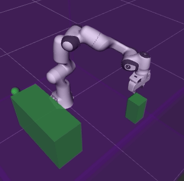

# Overview



The **Task Trees** is a software framework in Python designed to accelerate the development of behaviour-tree based robot arm manipulation applications. It offers a rich set of concrete instant-use behaviours, behaviour tree templates and application programming interfaces that enables a developer to start experimenting and crafting robotic tasks in a shortened development cycle.

The development of the task trees is an endeavour of the **Robotics and Autonomous Systems (RAS)** Group of the **Research Engineering Facility (REF)** team, **Queensland University of Technology (QUT)**. The group is dedicated to capability elevation in enabling autonomous systems research. 

The task trees framework is based on the **Arm Commander** [Github Repo](https://github.com/REF-RAS/arm_commander), another capability enabler developed by the Robotics and Autonomous Systems group. The arm commander has streamlined motion specification and planning, collision avoidance, and use of reference frames in a uniform interface that is motion planner and robot manipulator model indepedent. The general arm commander is a reference implementation that is based on the [moveit motion planning framework](https://ros-planning.github.io/moveit_tutorials/).

## Installation and Software Requirements

If you have docker engine installed, you can get the task trees and a robot simulator up and running in a short time. Refer to the [Installation Guide](INSTALL.md) for the docker based and conventional installation methods.

In summary, the task trees framework requires the following supporting software.
- Python 3.8 or above
- ROS Noetic with RViz 
- Moveit for ROS Noetic
- Pytree 2.2.3
- The [arm_commander](https://github.com/REF-RAS/arm_commander) package

## Use Cases of the Task Trees

The task trees framework offers components that may be used individually or collectively. Though ROS is the enabling technology for the supporting software of the task trees, ROS programming is not required. The developers have a lot of flexibility of how to intergrate their applications with the task trees.

### Use Case 1: Instant-Use Move Behaviours with PyTrees

The task trees framework provides a comprehensive set of ready-to-use behaviours of motion. These behaviours are subclasses of `py_trees.behaviour` and therefore compatible with the popular behaviour tree framework [py-trees](https://pypi.org/project/py-trees/). A robotic manipulation application based on py-trees can exploit these instant-use behaviour classes and shorten development time. The example program [source code](../../demos/pytrees_moves/simple_move_2.py) below uses the `DoMoveXYZ` class to move between two positions.
```
class SimpleMovePyTreesApplication():
    def __init__(self, arm_commander:GeneralCommander, spin_period_ms:int=10):
        self.arm_commander:GeneralCommander = arm_commander
        self.arm_commander.abort_move(wait=True)
        self.arm_commander.reset_world()
        self.arm_commander.wait_for_ready_to_move()

        self.root_sequence = self.create_move_branch()
        self.bt = BehaviourTree(self.root_sequence) 
        
        self.the_thread = threading.Thread(target=lambda: self.bt.tick_tock(period_ms=spin_period_ms), daemon=True)
        self.the_thread.start()  
    
    def create_move_branch(self) -> Composite:
        move_branch = Sequence ('move_branch', memory=True,
                children=[DoMoveXYZ('move_xyz', True, arm_commander=self.arm_commander, target_xyz=[0.3, 0.0, 0.2]), 
                          DoMoveXYZ('move_xyz', True, arm_commander=self.arm_commander, target_xyz=[0.3, 0.0, 0.6]), ],)
        return move_branch
```

### Use Case 2: Building Behaviour Trees with the Tree Builder

Developers may choose to utilize the behaviour tree templates offered by the task trees framework. As the below example demonstrates [source code](../../demos/task_moves/estop_move.py), the `GuardedTaskTreesManager` supports building behaviour trees with an initialization branch, one or more priority branch, and a guard that can halt the behaviour tree with a stop condition.  The `EStopMoveTaskManager` is specialized with an initialization of moving to a __stow__ pose and a branch with a move-to-random-position behaviour. It connects the `estop_state` of the `EStop` class as the guard condition. The `EStop` class represents a stop button in a GUI that can trigger the `estop_state`. 

```
class EStopMoveTaskManager(GuardedTaskTreesManager):
    def __init__(self, arm_commander:GeneralCommander, spin_period_ms:int=10):
        super(EStopMoveTaskManager, self).__init__(arm_commander)

        self.arm_commander.abort_move(wait=True)
        self.arm_commander.reset_world()

        self._set_initialize_branch(self.create_init_branch())
        self._add_priority_branch(self.create_move_branch())      

        self._install_bt_and_spin(self.bt, spin_period_ms)

        self.estop = EStop()
        self.set_global_guard_condition_fn(lambda: not self.estop.get_estop_state())
        self.estop.gui_loop()
        
    def create_move_branch(self) -> Composite:
        move_branch = Sequence('move_branch', memory=True,
                children=[DoMoveXYZ('move_xyz', True, arm_commander=self.arm_commander, target_xyz=
                        lambda: [random.uniform(0.1, 0.5), random.uniform(-0.3, 0.3), random.uniform(0.2, 0.6)]),],)
        return move_branch
    
    def create_init_branch(self) -> Composite:
        init_branch = Sequence('init_branch', memory=True,
                children=[DoMoveJointPose('reset_pose', True, arm_commander=self.arm_commander, 
                                    target_joint_pose=[0.00, -1.243, 0.00, -2.949, 0.00, 1.704, 0.785],), ],)
        return init_branch  
```


### Use Case 3: Task-Level Coordination with the Task Trees Manager

Task-level management is the main feature of the task trees framework. A task is defined as a sequence of conditional behaviours that achieve an outcome. The `GuardedTaskTreesManager` and the vanilla companion `TaskTreesManager` supports the association of a behaviour sub-tree as a task and the managed execution of tasks. In the example below [source code](../../demos/task_moves/task_move_1.py), the function call `_add_task_branch` associate a behaviour (of moving in a rectangular path) with the task class `MoveRectTask`.

```
class MoveRectTask(BasicTask):
    def __init__(self):
        super(MoveRectTask, self).__init__()

class SimpleTaskMoveManager(TaskTreesManager):
    def __init__(self, arm_commander:GeneralCommander, spin_period_ms:int=10):
        super(SimpleTaskMoveManager, self).__init__(arm_commander)

        self._set_initialize_branch(self.create_init_branch())
        self._add_task_branch(self.create_move_rect_branch(), MoveRectTask)

        self._install_bt_and_spin(self.bt, spin_period_ms)
        
    def create_move_rect_branch(self) -> Composite:
        move_branch = Sequence('move_branch', memory=True,
                children=[
                    DoMoveDisplaceXYZ('move_dy', True, arm_commander=self.arm_commander, dxyz=[0.0, 0.3, 0]), 
                    DoMoveDisplaceXYZ('move_dz', True, arm_commander=self.arm_commander, dxyz=[0, 0, 0.3]), 
                    DoMoveDisplaceXYZ('move_ndy', True, arm_commander=self.arm_commander, dxyz=[0, -0.3, 0]), 
                    DoMoveDisplaceXYZ('move_random_ndz', True, arm_commander=self.arm_commander, 
                      dxyz=lambda: [0.0, 0.0, random.uniform(-0.25, -0.35)]),],)
        return move_branch
    
    def create_init_branch(self) -> Composite:
        init_branch = Sequence('init_branch', memory=True,
                children=[DoMoveJointPose('reset_pose', True, arm_commander=self.arm_commander, 
                                    target_joint_pose=[0.00, -1.243, 0.00, -2.949, 0.00, 1.704, 0.785],), ],)
        return init_branch       
```
Call `submit_task()` to execute the task. This is an asynchronous call, enabling the use of `cancel_task()` to terminate the task, `wait_for_completion()` to block the execution until completion and 
```
        self.arm_commander = GeneralCommander('panda_arm')
        task_manager = SimpleTaskMoveManager(self.arm_commander)
        ...
        task_manager.submit_task(the_task:=MoveRectTask())
        the_task.wait_for_completion()    
```

### Use Case 4: Adding ROS interface to Task Trees based applications

The above three use cases do not involve ROS programming. However, in multi-device robotic applications, ROS programming for connecting the devices (e.g. sensors) is essential. 

The usual approach of implementing ROS clients in a behaviour is compatible with the task trees. There are other several design patterns for adding ROS interface to a task trees based application, which are illustrated in the examples provided in the package.
- A ROS message subscriber in a behaviour that listens for vision-based collision alerts from a camera node. Refer to the custom class `DoMoveTankGridVisualCDBlackboard` in the demo program `gridscan` [source code](../../demos/gridscan/behaviours_advanced.py).
- A ROS action server as an interface for executing tasks in a task tree manager. Refer to the server [source code](../../demos/task_moves/task_move_4.py) and the client [source code](../../demos/task_moves/task_move_4_gui.py) that uses buttons on a GUI to execute and cancel tasks. 


## Demonstrations and Programming Tutorials 

A comprehensive set of [demonstrations and programming tutorials](DEMO_CATALOGUE.md) is provided for developers. 

In addition, detailed discussion of the instant-use behaviour classes, defining new behaviour classes from a base class, using the built-in scene configuration manager, and using the task trees manager are available.

### Demo Program: Push-Block

The [Push-Block Program](DEMO_PUSHBLOCK.md) is one of the demonstrations. It simulates a robot arm moving a block between four side channels on an elevated surface. This example can illustrate many key features of the task trees framework (including the underlying arm commander).
- Task-level specification and management. Moving the block from the current channel to one of the three other target channels is defined as a task.
- Virtualization of motion. There are actually 6 physical start-end combinations. With the support of the arm commander, the 6 physical motion can be abstracted into one virtual channel A to channel B motion, which can be specified as one task.
- Using only instant-use behaviours. No programming of custom behaviour is required.
- Defining the behaviour tree with a template.
- The extension [ROS based Push-Block Demo Program](DEMO_PUSHBLOCK_ROS.md) demonstrates the decoupling of the console and the task trees manager and the use of a ROS interface as the middleware.    


- [Instant-Use Move Behaviours](BEHAVIOURS_GUIDE_MOVE.md) (To be updated).
- [Task Trees Manager and Templates](TASK_TREES_MANAGER.md) (to be available).
- [Scene Configuration Utilities](SCENE_SUPPORT.md).


### Developer

Dr Andrew Lui, Senior Research Engineer <br />
Robotics and Autonomous Systems, Research Engineering Facility <br />
Research Infrastructure <br />
Queensland University of Technology <br />

Latest update: Mar 2024
