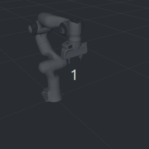
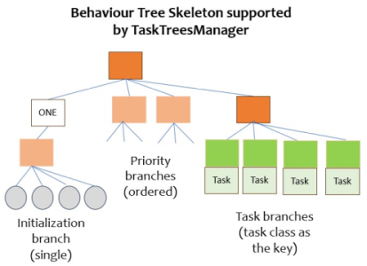
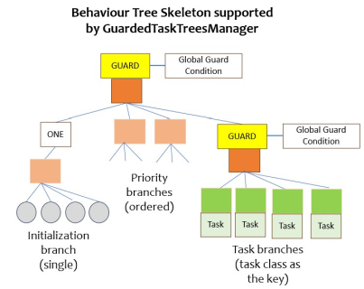

# Task Trees Manager

The task trees manager supports efficient building of task-based and conventional behaviour trees, as well as provides a programming interface for managing execution of the trees. It enables robotic manipulator applications building behaviour trees by adding custom branches of behaviours to a tree skeleton. The effort is significantly less than building the tree and its behaviours from scratch.

The task trees manager has implemented the concept of task, which is defined as a branch of behaviours designed to achieve an outcome. It supports the definition of task branches in the tree, submission and cancellation of tasks, and tracking their execution.

The current version of the task trees framework provides two concrete task tree manager classes,  `TaskTreesManager` and `GuardedTaskTreesManager`. 

## Tree Building with the TaskTreesManager Class

The `TaskTreesManager` class offers the following three ways of building customized behaviour trees.
- One initialization branch: the branch of behaviours is to be executed once when the tree is first executed.
- One or more task branches: a task branch is to be executed when its associated task is submitted to the tree. 
- One or more priority branches: a priority branch is always executed first and any task branch is executed only when all the priority branches return FAILURE status.

The following table summarizes the functions for adding the various branches.

| Functions | Parameters | Remarks |
| --- | --- | --- |
| `_set_initialize_branch(branch)` | a branch of behaviour tree |  |
| `_add_priority_branch(branch)` | a branch of behaviour tree of type `Composite` | the earlier the addition the higher is priority |
| `_add_task_branch(branch, task_class)` | a branch of behaviour tree of type `Composite` and the task class | the task class is a subclass of `BasicTask`|

THe following steps are recommended for building a behaviour tree or task tree for a new application:
1. Create a subclass of `TaskTreesManager`.  
2. In the constructor, call the above functions to add branches to the tree. Use one or more class functions to create the branches. 
3. Call `_install_bt_and_spin` to execute the tree.

### Basics of Building and Executing Behaviour Trees

The following is an example of building a behaviour tree with one initialization branch and one priority branch.

```
class SimpleMoveTaskManager(TaskTreesManager):
    def __init__(self, arm_commander:GeneralCommander, spin_period_ms:int=10):
        super(SimpleMoveTaskManager, self).__init__(arm_commander)

        self._set_initialize_branch(self.create_init_branch())
        self._add_priority_branch(self.create_move_branch())

        self._install_bt_and_spin(self.bt, spin_period_ms)
    
    def create_move_branch(self) -> Composite:
        move_branch = Sequence('move_branch', memory=True,
                children=[
                    DoMoveDisplaceXYZ('move_dy', True, arm_commander=self.arm_commander, dxyz=[0.0, 0.05, 0]), 
                    DoMoveDisplaceXYZ('move_dz', True, arm_commander=self.arm_commander, dxyz=[0, 0, 0.05]), 
                    DoMoveDisplaceXYZ('move_ndy', True, arm_commander=self.arm_commander, dxyz=[0, -0.05, 0]), 
                    DoMoveDisplaceXYZ('move_dz', True, arm_commander=self.arm_commander, dxyz=[0, 0, -0.05]),])
        return move_branch
    
    def create_init_branch(self) -> Composite:
        # - the branch that executes the task MoveNamedPoseTask
        init_branch = Sequence('init_branch', memory=True,
                children=[
                    DoMoveXYZRPY('reset_pose', True, arm_commander=self.arm_commander, target_xyz=[0.3, -0.2, 0.3], target_rpy=[3.139, 0.0, -0.785]), ],)
        return init_branch 

```
Notes:
- The initialization branch moves the end-effector to a position and orientation as defined in the function `create_init_branch`.
- The only priority branch executes a rectangular move pattern as defined in the function `create_move_branch`.
- The priority branch would be repeated indefintely.


An `arm_commander` object is required for the instant-use move behaviour. The following example main program first initializes an `arm_commander` object. Then create a new `SimpleMoveTaskManager` using the arm commander and finally call the inherited `spin` method 

```
if __name__=='__main__':
    try:
        arm_commander = GeneralCommander('panda_arm')
        arm_commander.abort_move(wait=True)
        arm_commander.reset_world()
        the_task_manager = SimpleMoveTaskManager(arm_commander)
        the_task_manager.spin()
    except Exception as e:
        logger.exception(e)
```

#### Example: A Timeout Priority Branch

A conditional or guarded priority branch is common. The following shows the use of conditional function `is_timeout` that returns `True` after 15 seconds since the start. The condition function is applied to the `DoMoveJointPose` behaviour so that it is activated after 15 seconds. Refer to `timeout_move.py` under `simple_moves` ([source code](../../demos/task_moves/timeout_move.py)).

```
    def __init__(self, arm_commander:GeneralCommander, spin_period_ms:int=10):
        ...
        self._set_initialize_branch(self.create_init_branch())
        self._add_priority_branch(self.create_timeout_branch())   

        self.start_time = time.time()   

        self._install_bt_and_spin(self.bt, spin_period_ms)
    ...

    def is_timeout(self, duration=30):
        return time.time() - self.start_time > duration

    def create_timeout_branch(self) -> Composite:
        timeout_branch = Sequence('move_branch', memory=True,
                children=[
                    DoMoveJointPose('reset_pose', {'_fn': self.is_timeout, 'duration': 15},
                                    arm_commander=self.arm_commander, 
                                    target_joint_pose=[0.00, -1.243, 0.00, -2.949, 0.00, 1.704, 0.785],), 
                    ],)
        return timeout_branch
    
    def create_init_branch(self) -> Composite:
        init_branch = Sequence('init_branch', memory=True,
                children=[
                    DoMoveXYZ('move_xyz', True, arm_commander=self.arm_commander, target_xyz=
                        lambda: [random.uniform(0.1, 0.5), random.uniform(-0.3, 0.3), random.uniform(0.2, 0.6)]), 
                    ],)
        return init_branch 
```


_In the above animation for this example, the initialization branch extends the arm. At 15 seconds since the start of the program, the `DoMoveJointPose` behaviour in the priority branch is activated by the `is_timeout` condition._

### Tasks Definition and Adding Task Branches

The **task** notion supported by the task trees manager enables more control over the execution of behaviours. 

A task tree has one or more task branches plus one or more priority branches and the initialization branches. The task branches are guarded and will not get executed until the task tree manager receives a submitted task. During the task execution, the task manager entertains queries on the execution state and the option to cancel the task. After the task execution, the task manager can be consulted on whether the execution was successful or details of the error occurred. 

The following shows how to define a task `MoveRectTask`, define the associated task branch and add the branch to the task tree. Refer to the program `task_move_1.py` under `task_moves` ([source code](../../demos/task_moves/task_move_1.py)).

The branch of the task executes a rectangular motion once.

A task definition is a subclass of `BasicTask`.

```
class MoveRectTask(BasicTask):
    def __init__(self):
        super(MoveRectTask, self).__init__()

class SimpleTaskMoveManager(TaskTreesManager):
    def __init__(self, arm_commander:GeneralCommander, spin_period_ms:int=10):
        super(SimpleTaskMoveManager, self).__init__(arm_commander)
        ...
        self._add_task_branch(self.create_move_rect_branch(), MoveRectTask)

        self._install_bt_and_spin(self.bt, spin_period_ms)
        
    def create_move_rect_branch(self) -> Composite:

        move_branch = Sequence( 'move_branch', memory=True,
                children=[
                    DoMoveDisplaceXYZ('move_dy', True, arm_commander=self.arm_commander, dxyz=[0.0, 0.3, 0]), 
                    DoMoveDisplaceXYZ('move_dz', True, arm_commander=self.arm_commander, dxyz=[0, 0, 0.3]), 
                    DoMoveDisplaceXYZ('move_ndy', True, arm_commander=self.arm_commander, dxyz=[0, -0.3, 0]), 
                    DoMoveDisplaceXYZ('move_random_ndz', True, arm_commander=self.arm_commander, 
                                      dxyz=lambda: [0.0, 0.0, random.uniform(-0.25, -0.35)]),               
                    ],)
        return move_branch

```
In the function call to `_add_task_branch` the task branch created in `create_move_rect_branch` is passed together with class reference `MoveRectTask`.

#### Example: Task Execution  

The task tree manager then awaits order to execute the `MoveRectTask`. To execute the task, call `submit_task` of the task trees manager.

The following class creates the task manager defined above, and then executes the `MoveRectTask` ten times in a for loop.

```
class TaskDemoApplication():
    """ The application program for the simple Task Demo
    """
    def __init__(self):
        ...
        self.the_task_manager = SimpleTaskMoveManager(self.arm_commander)
        self._run_demo()
    ...
        
    def _run_demo(self):
        task_manager = self.the_task_manager
        the_task = None
        logger.info(f'=== Task Demo Started') 
        for i in range(10):
            logger.info(f'=== Submit a MoveRectTask #{i + 1}')
            task_manager.submit_task(the_task:=MoveRectTask())
            the_task.wait_for_completion()    
```
Notes:
- The call to `submit_task` is asynchronous. The `MoveRectTask` task object is the handle for tracking the task execution.
- The function call to `wait_for_completion` is blocking until the task has entered into one of the completion states. The list of completion states can be found in [states.py](../../task_trees/states.py)

The following loop could replace the call to `wait_for_completion`.

```
from task_trees.states import COMPLETION_STATES
...
        while True:
            if the_task.get_state() in COMPLETION_STATES:
                break
            time.sleep(0.1)    
```

#### Example: Task Cancellation

Call the `cancel_task` function on the task object to cancel the task.
```
self.the_task.cancel(wait=True)
```
If the parameter `wait` is `True`, the function call will not return until the cancellation is completed. Usually, a loop to monitor the task state is needed. Note that although the eventual state is usually TaskStates.ABORTED, in a situation which the task is just completed (successful or otherwise) when the cancel function is called, the task may end up in other states.
```
the_task.cancel(wait=True)
while True:
    if the_task.get_state() in COMPLETION_STATES:
        break
    time.sleep(0.1)   
```

Refer to the example `task_move_4.py` under `task_moves` ([source code](../../demos/task_moves/task_move_4.py)). The example cancels the executing task when the GUI receives the command to execute another task. 

#### List of task states

| States | Is Completion | Remarks |
| --- | --- | --- |
| TaskStates.SUCCEEDED | Yes | |
| TaskStates.ABORTED | Yes | the task has been cancelled |
| TaskStates.GUARD_ABORTED | Yes | the task has been aborted by the task tree guard |
| TaskStates.FAILED | Yes | the task experienced a failure |
| TaskStates.INVALID | Yes | the task submission was invalid |
| TaskStates.SUBMITTED | No | the task has just been submitted but not executed yet | 
| TaskStates.WORKING | No | the associated task branch is being executed |
| TaskStates.STANDBY | No | the task has not yet been submitted |

### Task Parameters

The task trees manager supports parameters in task definition. 

The following task, which moves to a random y position, has two parameters `min_y` and `max_y` that confine the range.
```
class MoveRandomTask(BasicTask):
    def __init__(self, min_y:float, max_y:float):
        super(MoveRandomTask, self).__init__()
        self.min_y = min_y
        self.max_y = max_y
```
The task branch has a behaviour that obtains the move target from a function (i.e. dynamic binding).
```
    def create_move_random_branch(self) -> Composite:
        move_branch = Sequence('move_branch', memory=True,
                children=[
                        DoMoveXYZ('move_random_y', True, arm_commander=self.arm_commander, target_xyz=self.generate_random_xyz),                                      
                    ],)
        return move_branch 
```
The definition of the function `generate_random_xyz` is shown below, which accesses the task object and the two parameters through the blackboard of py-trees. The framework provides access to the task object under the key 'task' on the py-trees blackboard.
```
    def generate_random_xyz(self) -> list:
        if not self.the_blackboard.exists('task'):
            raise TypeError(f'unable to generate random pose due to no task has been submitted')
        min_y = self.the_blackboard.task.min_y
        max_y = self.the_blackboard.task.max_y           
        xyz = [None, random.uniform(min_y, max_y), None]
        return xyz
```
### List of TaskTreesManager Functions

| Functions | Parameters | Remarks |
| --- | --- | --- |
| shutdown |  | Shutdown the task manager properly |
| _define_named_poses | scene configuration object | extract the named poses and add to the arm commander |
| _define_objects | scene configuration object | extract the collision object definitions and add to the arm commander |
| _set_initialize_branch | a tree branch | setup the initialization branch |
|  _add_priority_branch | a tree branch | add the branch as a priority branch |
| _add_task_branch | a tree branch and the task class definition | add a task  branch |
| display_tree | the branch to display (optional) | output the graphical representation of the tree or a subtree |

### List of BasicTask Functions

| Functions | Parameters | Remarks |
| --- | --- | --- |
| get_state | | return the state of the task |
| cancel | wait | cancel the task and return immediately if wait is False |
| wait_for_completion | | block until the task is completed |
| wait_for_working | | block until the task is in the WORKING state |
| get_time_since_submit | | return the time lapsed since task submission |
| get_commander_feedback | | return the final message from the arm commander on this task|



## Tree Building with the GuardedTaskTreesManager Class

Another manager included in the task trees framework is `GuardedTaskTreesManager`. This is a subclass of `TaskTreesManager` and the additional features are two guard conditions that can inactivate the whole behaviour tree and inactivate the task branches respectively.

The class provides two functions for setting up the guard conditions.
- `set_global_guard_condition_fn(global_guard_condition_fn)`: the whole behaviour tree is inactivated if the function `global_guard_condition_fn` returns `False`.
- `set_task_guard_condition_fn(task_guard_condition_fn)`: the task branches are inactivated if the function `task_guard_condition_fn` returns `False`.

The current task will be aborted and its state changed to `TaskStates.GUARD_ABORTED`.

By default, the `GuardedTaskTreesManager` requires a call to `reset_guard` after inactivation. The constructor offers a parameter to change the `guard_reset` to `False` so that the behaviour tree is reactivated once the guard condition returns `True` again.



### Examples

A simple example is given in the program `estop_move.py` under `task_moves` ([source code](../../demos/task_moves/estop_move.py)).

A more advanced example can be found in the demo program [PickNDrop](DEMO_PICKNDROP_ESTOP.md).


