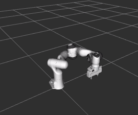
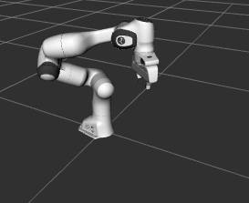
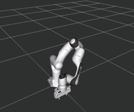

# Tutorial: Instant-Use Move Behaviours with PyTrees

This tutorials illustrates examples of using the move behaviour classes for building behaviour trees based on py-tree.

This demo requires the Panda robot model.

[Source Code](../../demos/pytrees_moves/simple_move_1.py)

## Running the Demo Program

Assume that the task trees and the arm commander packages are installed in a catkin_workspace. Refer to the [Installation Guide](INSTALL.md)

- Change directory to the root of the catkin workspace, run `source devel/setup.bash`.
- Change directory to this demo folder, run one of the demo programs such as  `/usr/bin/python3 simple_move_1.py`.

## Example 1: The Minimal Program

The program `simple_move_1.py` illustrates a small program that build the simplest behaviour tree and populate it with a move behaviour class.

The following is the common constructor for the series of demo programs. It setups the arm commander, creates a branch and stick the branch to a py-tree `BehaviourTree` object. It finally creates a new thread to run the behaviour tree.
```
...
    def __init__(self, arm_commander:GeneralCommander, spin_period_ms:int=10):
        # setup the robotic manipulation platform through the commander
        self.arm_commander:GeneralCommander = arm_commander
        self.arm_commander.abort_move(wait=True)
        self.arm_commander.reset_world()
        self.arm_commander.wait_for_ready_to_move()
        # build the behaviour tree
        self.root_sequence = self.create_move_branch()  ##### populate the branch
        self.bt = BehaviourTree(self.root_sequence) 
        py_trees.display.render_dot_tree(self.bt.root)
        # spin the tree
        self.the_thread = threading.Thread(target=lambda: self.bt.tick_tock(period_ms=spin_period_ms), daemon=True)
        self.the_thread.start() 
```
The function `create_move_branch` is given below, which creates a Sequence of one behaviour.
```
    def create_move_branch(self) -> Composite:

        move_branch = py_trees.composites.Sequence(
                'move_branch',
                memory=True,
                children=[
                    DoMoveXYZ('move_xyz', True, arm_commander=self.arm_commander, target_xyz=[0.3, 0.0, 0.6]), 
                ],
        )
        return move_branch
```
It passes a constant to the `target_xyz` parameter, which moves the end-effector to xyz = [0.3, 0.0, 0.6] in the default reference frame.

## Example 2: Two Behaviours in a Sequence

The program `simple_move_2.py` defines a sequence with two behaviours.
```
    def create_move_branch(self) -> Composite:

        move_branch = py_trees.composites.Sequence(
                'move_branch',
                memory=True,
                children=[
                    DoMoveXYZ('move_xyz', True, arm_commander=self.arm_commander, target_xyz=[0.3, 0.0, 0.2]), 
                    DoMoveXYZ('move_xyz', True, arm_commander=self.arm_commander, target_xyz=[0.3, 0.0, 0.6]), 
                    ],)
        return move_branch
```

## Example 3: Late Binding of the Target XYZ

The program `simple_move_3.py` shows how the class `DoMoveXYZ` can accept a function so that the target xyz is determined at the tick-tock time.
```
    def create_move_branch(self) -> Composite:

        move_branch = py_trees.composites.Sequence(
                'move_branch',
                memory=True,
                children=[
                    DoMoveXYZ('move_xyz', True, arm_commander=self.arm_commander, target_xyz=self.generate_random_xyz), 
                    ],)
        return move_branch
```
The function `self.generate_random_xyz` is listed below. It returns a xyz list with each of the three components randomly generated.
```
    def generate_random_xyz(self) -> list:
        xyz = [random.uniform(0.1, 0.5), random.uniform(-0.3, 0.3), random.uniform(0.2, 0.6)]
        logger.info(f'generate_random_xyz: {xyz}')
        return xyz
```


## Example 4: Two Sequence Branches and the class `DoMoveXYZRPY`

The program `simple_move_4.py` shows a behaviour tree with two sequence branches. It also demonstrates how separating the target position and orientation in the class `DoMoveXYZRPY` enables finer movement control.

The constructor has included code that creates two branches.
```
        ...
        # build the behaviour tree
        self.move_branch = self.create_move_branch()
        self.init_branch = self.create_init_branch()
        self.init_branch = py_trees.decorators.OneShot('init_oneshot_branch', policy = py_trees.common.OneShotPolicy.ON_COMPLETION, child=self.init_branch)
    
        self.root_sequence = py_trees.composites.Sequence('root_sequence', memory=True, children=[
            self.init_branch,
            self.move_branch,
            ])
```
The function `create_init_branch`.
```
    def create_init_branch(self) -> Composite:
        init_branch = py_trees.composites.Sequence(
                'init_branch',
                memory=True,
                children=[
                    DoMoveXYZRPY('reset_pose', True, arm_commander=self.arm_commander, target_xyz=[0.307, 0.0, 0.588],
                                 target_rpy=[3.139, 0.0, -0.785]), 
                    ],)
        return init_branch  
```
The function `create_move_branch`. Note that the parameter `target_xyz` is a compositional list. The first value specifies only x = 0.3 but leaves the y and z open. The second value provides a random y and a random z. The x component of the second value is ignored because x is already specified by the first value.
```
    def create_move_branch(self) -> Composite:
        move_branch = py_trees.composites.Sequence(
                'move_branch',
                memory=True,
                children=[
                    DoMoveXYZRPY('move_xyzrpy', True, arm_commander=self.arm_commander, 
                                 target_xyz=[[0.3, None, None], self.generate_random_xyz],
                                 target_rpy=self.generate_random_rpy), 
                    ],
        )
        return move_branch
```
The following table explains the composition of the parameter `target_xyz`.

| The Rank | The Value | Composition of the Target XYZ | Remarks |
| --- | --- | --- | --- |
| 0 |   | `[None, None, None]` | |
| 1 | `[0.3, None, None]` | `[0.3, None, None]` | |
| 2 | self.generate_random_xyz |  `[0.3, ry, rz]` | Assume the function returns [rx, ry, rz] |




## Example 5: More Complex Trees and the class `DoMoveDisplaceXYZ`

The program `simple_move_5.py` shows a more complex move branch, which utilizes also the `Repeat` decorator from py-trees. It defines a movement along the four sides of a rectangle. The sequence is moving right, up, left, and down, each side is divided into 5 steps.

```
    def create_move_branch(self) -> Composite:

        move_branch = py_trees.composites.Sequence(
                'move_branch',
                memory=True,
                children=[
                    py_trees.decorators.Repeat('repeat_move_dy', child=DoMoveDisplaceXYZ('move_dy', True, arm_commander=self.arm_commander, dxyz=[0.0, 0.05, 0]), 
                        num_success=5),
                    py_trees.decorators.Repeat('repeat_move_dz', child=DoMoveDisplaceXYZ('move_dz', True, arm_commander=self.arm_commander, dxyz=[0, 0, 0.05]), 
                        num_success=5),
                    py_trees.decorators.Repeat('repeat_move_ndy', child=DoMoveDisplaceXYZ('move_ndy', True, arm_commander=self.arm_commander, dxyz=[0, -0.05, 0]), 
                        num_success=5),
                    py_trees.decorators.Repeat('repeat_move_ndz', child=DoMoveDisplaceXYZ('move_random_ndz', True, arm_commander=self.arm_commander, dxyz=self.generate_random_dxyz), 
                        num_success=5),                    
                    ],
        )
        return move_branch
```


## Example 6: Two Behaviours in a Sequence using `DoMovePose`

The program `simple_move_6.py` defines a sequence with two behaviours using `DoMovePose`, with which both position and rotation can be specified.
```
    def create_move_branch(self) -> Composite:

        move_branch = py_trees.composites.Sequence(
                'move_branch',
                memory=True,
                children=[
                    DoMovePose('move_xyzrpy', True, arm_commander=self.arm_commander, target_pose=[0.5, 0.0, 0.2, 3.14, 0, 1.58]), 
                    DoMovePose('move_xyzrpy', True, arm_commander=self.arm_commander, target_pose=[0.5, 0.0, 0.5, 3.14, 0.2, 0]),
                    ],)
        return move_branch
```

## Example 7: Late Binding of the Target Pose in `DoMovePose`

The program `simple_move_7.py` shows how the class `DoMovePose` can accept a function so that the target pose is determined at the tick-tock time. In this example, the target pose is based on the current pose with a random component from (x, y, z, yaw) changed by a random value.
```
    def create_move_branch(self) -> Composite:

        move_branch = py_trees.composites.Sequence(
                'move_branch',
                memory=True,
                children=[
                    DoMovePose('move_random_step', True, arm_commander=self.arm_commander, target_pose=self.generate_random_move), 
                    ],)
        return move_branch
```
The function `self.generate_random_move` is listed below. It obtains the current pose in xyzrpy format and then 
```
    def generate_random_move(self) -> list:
        xyzrpy = self.arm_commander.pose_in_frame_as_xyzrpy()
        which_dim = random.randint(0, 4)
        if which_dim in [0, 1, 2]:
            xyzrpy[which_dim] += random.uniform(-0.2, 0.2)   # the x, y, or z component
        elif which_dim == 3:
            xyzrpy[5] += random.uniform(-1.57, 1.57)         # the yaw component
        logger.info(f'generate_random_move: {xyzrpy}')
        return xyzrpy
```


### Author

Dr Andrew Lui, Senior Research Engineer <br />
Robotics and Autonomous Systems, Research Engineering Facility <br />
Research Infrastructure <br />
Queensland University of Technology <br />

Latest update: Mar 2024