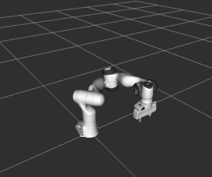

# Tutorial: Instant-Use Move Behaviours with Task Trees

This tutorials illustrates examples of using the move behaviour classes for building behaviour trees based on the **Task Trees** framework.

The task trees framework reduces the complexity in building behaviour trees by providing a skeleton behaviour tree and functions for operating the tree with ease.

This demo requires the Panda robot model.

[Source Code](../../demos/simple_moves/simple_move_1.py)

## Running the Demo Program

Assume that the task trees and the arm commander packages are installed in a catkin_workspace. Refer to the [Installation Guide](INSTALL.md)

- Change directory to the root of the catkin workspace, run `source devel/setup.bash`.
- Change directory to this demo folder, run one of the demo programs such as  `/usr/bin/python3 simple_move_1.py`.

## Example 1: The Minimal Program

The program `simple_move_1.py` illustrates a small program that build the simplest behaviour tree and populate it with a move behaviour class.

The following is the common constructor for the series of demo programs. The class is based on the `TaskTreeManager`, which is the baseline framework class. 

It setups the arm commander, creates a branch and stick the branch to the framework through the function `_add_priority_branch`. Finally, the function `_install_bt_and_spin` is called to run the behaviour tree.
```
class SimpleMoveApplication(TaskTreesManager):

    def __init__(self, arm_commander:GeneralCommander, spin_period_ms:int=10):
        super(SimpleMoveApplication, self).__init__(arm_commander)

        # setup the robotic manipulation platform through the commander
        self.arm_commander.abort_move(wait=True)
        self.arm_commander.reset_world()

        # build and install the behavior tree
        self._add_priority_branch(self.create_move_branch())
        
        # install and unleash the behaviour tree
        self._install_bt_and_spin(self.bt, spin_period_ms)
```
The function `create_move_branch` is given below, which creates a Sequence of one behaviour.
```
    def create_move_branch(self) -> Composite:

        move_branch = py_trees.composites.Sequence(
                'move_branch',
                memory=True,
                children=[
                    DoMoveXYZ('move_xyz', True, arm_commander=self.arm_commander, target_xyz=[0.3, 0.0, 0.6]), 
                ],
        )
        return move_branch
```
It passes a constant to the `target_xyz` parameter, which moves the end-effector to xyz = [0.3, 0.0, 0.6] in the default reference frame.

## Example 2: Two Behaviours in a Sequence

The program `simple_move_2.py` defines a sequence with two behaviours.
```
    def create_move_branch(self) -> Composite:

        move_branch = py_trees.composites.Sequence(
                'move_branch',
                memory=True,
                children=[
                    DoMoveXYZ('move_xyz', True, arm_commander=self.arm_commander, target_xyz=[0.3, 0.0, 0.2]), 
                    DoMoveXYZ('move_xyz', True, arm_commander=self.arm_commander, target_xyz=[0.3, 0.0, 0.6]), 
                    ],)
        return move_branch
```

## Example 3: Late Binding of the Target XYZ

The program `simple_move_3.py` shows how the class `DoMoveXYZ` can accept a function so that the target xyz is determined at the tick-tock time.
```
    def create_move_branch(self) -> Composite:

        move_branch = py_trees.composites.Sequence(
                'move_branch',
                memory=True,
                children=[
                    DoMoveXYZ('move_xyz', True, arm_commander=self.arm_commander, target_xyz=self.generate_random_xyz), 
                    ],)
        return move_branch
```
The function `self.generate_random_xyz` is listed below. It returns a xyz list with each of the three components randomly generated.
```
    def generate_random_xyz(self) -> list:
        xyz = [random.uniform(0.1, 0.5), random.uniform(-0.3, 0.3), random.uniform(0.2, 0.6)]
        logger.info(f'generate_random_xyz: {xyz}')
        return xyz
```


## Example 4: Two Sequence Branches and the class `DoMoveXYZRPY`

The program `simple_move_4.py` shows a behaviour tree with two sequence branches. It also demonstrates how separating the target position and orientation in the class `DoMoveXYZRPY` enables finer movement control.

The constructor has included code that creates two branches.
```
        ...
        # build the behaviour tree
        self.move_branch = self.create_move_branch()
        self.init_branch = self.create_init_branch()
        self.init_branch = py_trees.decorators.OneShot('init_oneshot_branch', policy = py_trees.common.OneShotPolicy.ON_COMPLETION, child=self.init_branch)
    
        self.root_sequence = py_trees.composites.Sequence('root_sequence', memory=True, children=[
            self.init_branch,
            self.move_branch,
            ])
```
The function `create_init_branch`.
```
    def create_init_branch(self) -> Composite:
        init_branch = py_trees.composites.Sequence(
                'init_branch',
                memory=True,
                children=[
                    DoMoveXYZRPY('reset_pose', True, arm_commander=self.arm_commander, target_xyz=[0.307, 0.0, 0.588],
                                 target_rpy=[3.139, 0.0, -0.785]), 
                    ],)
        return init_branch  
```
The function `create_move_branch`. Note that the parameter `target_xyz` is a compositional list. The first value specifies only x = 0.3 but leaves the y and z open. The second value provides a random y and a random z. The x component of the second value is ignored because x is already specified by the first value.
```
    def create_move_branch(self) -> Composite:
        move_branch = py_trees.composites.Sequence(
                'move_branch',
                memory=True,
                children=[
                    DoMoveXYZRPY('move_xyzrpy', True, arm_commander=self.arm_commander, 
                                 target_xyz=[[0.3, None, None], self.generate_random_xyz],
                                 target_rpy=self.generate_random_rpy), 
                    ],
        )
        return move_branch
```
The following table explains the composition of the parameter `target_xyz`.

| The Rank | The Value | Composition of the Target XYZ | Remarks |
| --- | --- | --- | --- |
| 0 |   | `[None, None, None]` | |
| 1 | `[0.3, None, None]` | `[0.3, None, None]` | |
| 2 | self.generate_random_xyz |  `[0.3, ry, rz]` | Assume the function returns [rx, ry, rz] |


## Example 5: More Complex Trees and the class `DoMoveDisplaceXYZ`

The program `simple_move_5.py` shows a more complex move branch, which utilizes also the `Repeat` decorator from py-trees. It defines a movement along the four sides of a rectangle. The sequence is moving right, up, left, and down, each side is divided into 5 steps.

```
    def create_move_branch(self) -> Composite:

        move_branch = py_trees.composites.Sequence(
                'move_branch',
                memory=True,
                children=[
                    py_trees.decorators.Repeat('repeat_move_dy', child=DoMoveDisplaceXYZ('move_dy', True, arm_commander=self.arm_commander, dxyz=[0.0, 0.05, 0]), 
                        num_success=5),
                    py_trees.decorators.Repeat('repeat_move_dz', child=DoMoveDisplaceXYZ('move_dz', True, arm_commander=self.arm_commander, dxyz=[0, 0, 0.05]), 
                        num_success=5),
                    py_trees.decorators.Repeat('repeat_move_ndy', child=DoMoveDisplaceXYZ('move_ndy', True, arm_commander=self.arm_commander, dxyz=[0, -0.05, 0]), 
                        num_success=5),
                    py_trees.decorators.Repeat('repeat_move_ndz', child=DoMoveDisplaceXYZ('move_random_ndz', True, arm_commander=self.arm_commander, dxyz=self.generate_random_dxyz), 
                        num_success=5),                    
                    ],
        )
        return move_branch
```


## Example 6: Two Behaviours in a Sequence using `DoMovePose`

The program `simple_move_6.py` defines a sequence with two behaviours using `DoMovePose`, with which both position and rotation can be specified.
```
    def create_move_branch(self) -> Composite:

        move_branch = py_trees.composites.Sequence(
                'move_branch',
                memory=True,
                children=[
                    DoMovePose('move_xyzrpy', True, arm_commander=self.arm_commander, target_pose=[0.5, 0.0, 0.2, 3.14, 0, 1.58]), 
                    DoMovePose('move_xyzrpy', True, arm_commander=self.arm_commander, target_pose=[0.5, 0.0, 0.5, 3.14, 0.2, 0]),
                    ],)
        return move_branch
```

## Example 7: Late Binding of the Target Pose in `DoMovePose`

The program `simple_move_7.py` shows how the class `DoMovePose` can accept a function so that the target pose is determined at the tick-tock time. In this example, the target pose is based on the current pose with a random component from (x, y, z, yaw) changed by a random value.
```
    def create_move_branch(self) -> Composite:

        move_branch = py_trees.composites.Sequence(
                'move_branch',
                memory=True,
                children=[
                    DoMovePose('move_random_step', True, arm_commander=self.arm_commander, target_pose=self.generate_random_move), 
                    ],)
        return move_branch
```
The function `self.generate_random_move` is listed below. It obtains the current pose in xyzrpy format and then 
```
    def generate_random_move(self) -> list:
        xyzrpy = self.arm_commander.pose_in_frame_as_xyzrpy()
        which_dim = random.randint(0, 4)
        if which_dim in [0, 1, 2]:
            xyzrpy[which_dim] += random.uniform(-0.2, 0.2)   # the x, y, or z component
        elif which_dim == 3:
            xyzrpy[5] += random.uniform(-1.57, 1.57)         # the yaw component
        logger.info(f'generate_random_move: {xyzrpy}')
        return xyzrpy
```

## Example 8: Multi-Pose Move with `DoMoveMultiPose`

The program `multi_move_1.py` defines a move_branch with one behaviour of the class `DoMoveMultiPose`, of which the movement is a continous
one passing through multiple poses or waypoints. The `target_poses` parameter accepts a list of poses, each of which can be a 6-list (xyzrpy),
7-list (xyzqqqq), Pose, or PoseStamped. 
```
    def create_move_branch(self) -> Composite:

        move_branch = py_trees.composites.Sequence(
                'move_branch',
                memory=True,
                children=[
                    DoMoveMultiPose('move_xyz', True, arm_commander=self.arm_commander, target_poses=[
                        (0.6, 0.0, 0.4, 3.14, 0, 0), 
                        (0.6, 0.2, 0.5, 3.14, 0, 0), 
                        (0.6, 0.2, 0.6, 3.14, 0, 1.58), 
                        (0.6, 0.0, 0.7, 3.14, 0, 3.14), 
                        (0.6, -0.2, 0.6, 3.14, 0, 1.58), 
                        (0.6, -0.2, 0.5, 3.14, 0, 0), 
                        (0.6, 0.0, 0.4, 3.14, 0, 0),
                        ]), 
                    ],
        )
        return move_branch
```


## Example 9: Late Binding of the Target Poses in `DoMoveMultiPose`

The behaviour class `DoMoveMultiPose` supports late binding in the parameters `target_poses` and `reference_frames`. 

The program `multi_move_2.py` defines a move_branch with three behaviours. The first behaviour `DoMovePose` moves the end-effector to a constant starting pose. The second behaviour, based on `DoMoveMultiPose`, minics a scan pattern along the y and z axes. The final behaviour, also based on  `DoMoveMultiPose`, rotates the end effector randomly. The last two behaviours use late binding so that the poses can be generated on the fly based on the current pose of the end effector.
```
        ...
        children=[
            DoMovePose('move_start_pose', True, arm_commander=self.arm_commander, target_pose=[0.3, 0.0, 0.3, 3.14, 0, 2.3]), 
            DoMoveMultiPose('scan_move_pattern', True, arm_commander=self.arm_commander, target_poses=self.generate_scan_movement), 
            DoMoveMultiPose('multi_rotations', True, arm_commander=self.arm_commander, target_poses=self.generate_random_rotations),                     
            ],
        ...
```
The second behaviour specifies the function `generate_scan_movement` as the target_poses. The function returns a list of 6-list (xyzrpy) poses generated using the current pose as the starting point during tick-tock time.
```
    SCAN_PATTERN = [(1, 0.3), (1, -0.6), (2, 0.05), 
                    (1, 0.6), (1, -0.6), (2, 0.05), 
                    (1, 0.6), (1, -0.3)]
    def generate_scan_movement(self) -> list:
        xyzrpy = self.arm_commander.pose_in_frame_as_xyzrpy()
        target_poses = [xyzrpy]
        # change the xyzrpy pose according to the SCAN_PATTERN, of which each element comprises (the index to change, the change value)
        for s in MultiMoveTaskManager.SCAN_PATTERN:
            xyzrpy = xyzrpy.copy()
            xyzrpy[s[0]] += s[1]
            target_poses.append(xyzrpy)
        logger.info(f'generate_scan_movement: {xyzrpy}')
        return target_poses
```
The last behaviour specifies the function `generate_random_rotations` as the target poses. 
```
    def generate_random_rotations(self) -> list:
        xyzrpy = self.arm_commander.pose_in_frame_as_xyzrpy()
        target_poses = [xyzrpy]
        # change the yaw component of the xyzrpy pose randomly
        for i in range(10):
            xyzrpy = xyzrpy.copy()
            xyzrpy[5] += random.uniform(-1.57, 1.57)
            target_poses.append(xyzrpy)
        logger.info(f'generate_random_rotations: {xyzrpy}')
        return target_poses
```


### Author

Dr Andrew Lui, Senior Research Engineer <br />
Robotics and Autonomous Systems, Research Engineering Facility <br />
Research Infrastructure <br />
Queensland University of Technology <br />

Latest update: Mar 2024