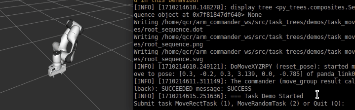
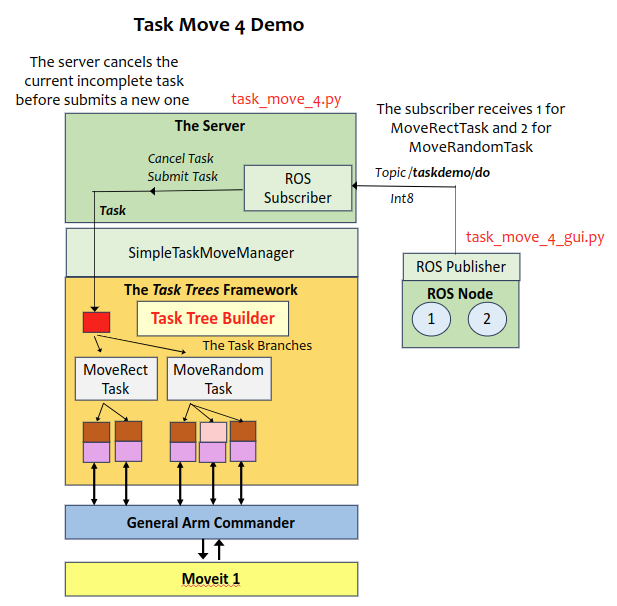
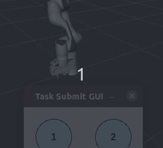

# Tutorial: Tasks Specification and Execution with Task Trees Manager

This tutorials illustrates how to define tasks for the task tree manager, and to submit tasks to the task trees manager and wait for its completion.

This demo requires the Panda robot model.

[Source Code](../../demos/task_moves/task_move_1.py)

## Running the Demo Program

Assume that the task trees and the arm commander packages are installed in a catkin_workspace. Refer to the [Installation Guide](INSTALL.md)

- Change directory to the root of the catkin workspace, run `source devel/setup.bash`.
- Change directory to this demo folder, run one of the demo programs such as  `/usr/bin/python3 task_move_1.py`.

## Example 1: Defining a Task with No Parameter

The program `task_move_1.py` illustrates a small demo that defines a token task `MoveRectTask`.

First, define the behaviour subtree for the task, which moves in a rectangular path
```
    def create_move_rect_branch(self) -> Composite:

        move_branch = py_trees.composites.Sequence(
                'move_branch',
                memory=True,
                children=[
                    DoMoveDisplaceXYZ('move_dy', True, arm_commander=self.arm_commander, dxyz=[0.0, 0.3, 0]), 
                    DoMoveDisplaceXYZ('move_dz', True, arm_commander=self.arm_commander, dxyz=[0, 0, 0.3]), 
                    DoMoveDisplaceXYZ('move_ndy', True, arm_commander=self.arm_commander, dxyz=[0, -0.3, 0]), 
                    DoMoveDisplaceXYZ('move_random_ndz', True, arm_commander=self.arm_commander, dxyz=self.generate_random_dxyz),               
                    ],
        )
        return move_branch
```
Second, define the token class for `MoveRectTask`

```
class MoveRectTask(BasicTask):
    def __init__(self):
        """ the constructor for a task moving in a rectangle pattern
        """
        super(MoveRectTask, self).__init__()
```

Third, add the above two to the task branch in the behaviour tree skeleton managed by the task trees manager 
```
    self._add_task_branch(self.create_move_rect_branch(), MoveRectTask)
```

Finally, define the following demo application that submit the tasks 10 times to the task trees manager.
```
class TaskDemoApplication():
    """ The application program for the simple Task Demo
    """
    def __init__(self):
        signal.signal(signal.SIGINT, self.stop)
        self.the_blackboard = py_trees.blackboard.Client()
        self.the_blackboard.register_key(key='the_object', access=py_trees.common.Access.READ)  
        
        self.arm_commander = GeneralCommander('panda_arm')
        self.arm_commander.abort_move(wait=True)
        self.arm_commander.reset_world()
        self.the_task_manager = SimpleTaskMoveManager(self.arm_commander)
        self.the_task_manager.display_tree()
        self.to_stop = False
        self._run_demo()
        self.the_task_manager.spin()
        
    def stop(self, *args, **kwargs):
        logger.info('stop signal received')
        self.the_task_manager.shutdown()
        sys.exit(0)
        
    def _run_demo(self):
        task_manager = self.the_task_manager
        the_task = None
        logger.info(f'=== Task Demo Started') 
        for i in range(10):
            logger.info(f'=== Submit a MoveRectTask #{i + 1}')
            task_manager.submit_task(the_task:=MoveRectTask())
            the_task.wait_for_completion()    
```


## Example 2: Defining a Task with Parameters

The program `task_move_2.py` illustrates the definition and handling of a task with parameters. The task `MoveRandomTask` moves to three random y positions while keeping the current x and z values. The minimum and maximum y random values can be specified in the parameters `min_y` and `max_y`.

First, define the behaviour subtree for the task
```
    def create_move_3_random_branch(self) -> Composite:
        """ Returns a behaviour tree branch that move the end_effector in a rectangular path
        :return: a branch for the behaviour tree  
        :rtype: Composite
        """
        move_branch = py_trees.composites.Sequence(
                'move_branch',
                memory=True,
                children=[
                        DoMoveXYZ('move_random_y_1', True, arm_commander=self.arm_commander, target_xyz=self.generate_random_xyz), 
                        DoMoveXYZ('move_random_y_2', True, arm_commander=self.arm_commander, target_xyz=self.generate_random_xyz), 
                        DoMoveXYZ('move_random_y_3', True, arm_commander=self.arm_commander, target_xyz=self.generate_random_xyz),                                       
                    ],
        )
        return move_branch   
```

Second, define the task class.
```
class MoveRandomTask(BasicTask):
    def __init__(self, min_y:float, max_y:float):
        """ the constructor for a task moving to three random locations along the y axis
        """
        super(MoveRandomTask, self).__init__()
        self.min_y = min_y
        self.max_y = max_y
```

Third, add the above two to the task branch of the behaviour tree skeleton of the task trees manager.
```
    self._add_task_branch(self.create_move_3_random_branch(), MoveRandomTask)
```
Fourth, implement the function generate_random_xyz. This function needs access to the task parameters `min_y` and `max_y`. The framework provides access to the current Task object in the blackboard under the key `task`.
```
    def generate_random_xyz(self) -> list:
        if not self.the_blackboard.exists('task'):
            raise TypeError(f'unable to generate random pose due to no task has been submitted')
        min_y = self.the_blackboard.task.min_y
        max_y = self.the_blackboard.task.max_y           
        xyz = [None, random.uniform(min_y, max_y), None]
        return xyz
```

Finally, create a demo application that submit the task to the task trees manager.
```
class TaskDemoApplication():
    ... 
    def _run_demo(self):
        task_manager = self.the_task_manager
        the_task = None
        logger.info(f'=== Task Demo Started') 

        logger.info(f'=== Submit a MoveRandomTask (-0.2, 0.2)')
        task_manager.submit_task(the_task:=MoveRandomTask(-0.2, 0.2))
        the_task.wait_for_completion()    
        
        logger.info(f'=== Submit a MoveRandomTask (0.1, 0.4)')
        task_manager.submit_task(the_task:=MoveRandomTask(0.1, 0.4))
        the_task.wait_for_completion()        
```

## Example 3: Interactive Task Execution 

The program `task_move_3.py` illustrates the implementation of a simple interactive text console for executing tasks. The two tasks defined above `MoveRectTask` and `MoveRandomTask` are defined in this example program.
```
    self._add_task_branch(self.create_move_rect_branch(), MoveRectTask)
    self._add_task_branch(self.create_move_3_random_branch(), MoveRandomTask) 
```

The interactive application is shown below.
```
class TaskDemoApplication():
    ...
    def _run_demo(self):
        task_manager = self.the_task_manager
        the_task = None
        time.sleep(5.0)
        logger.info(f'=== Task Demo Started') 
        while True:
            while True:
                target = input('Submit task MoveRectTask (1), MoveRandomTask (2) or Quit (Q): ')
                if target in ['1', '2', 'Q']:
                    break
                time.sleep(0.1)
            if target == 'Q':
                sys.exit(0)
            elif target == '1':
                task_manager.submit_task(the_task:=MoveRectTask())
                the_task.wait_for_completion() 
            elif target == '2':
                task_manager.submit_task(the_task:=MoveRandomTask(-0.3, 0.3))
                the_task.wait_for_completion() 
```



## Example 4: Interactive Task Execution and Cancellation with ROS, GUI Interface

This example is a client-server application that illustrates the use ROS topic messages to execute and cancel tasks from a GUI interface. The server, the task, and the task trees manager are defined in the file `task_move_4.py` and the GUI interface with a ROS client is defined in `task_move_4_gui.py`. The design of the application is shown below.





The class `SimpleTaskMoveManager` and the task definitions are unchanged from Example 3. The interactive application is replaced with the follwoing ROS server that listens on the topic `/taskdemo/do`.

```
class TaskDemoROSServer():
    def __init__(self):
    ...
        # subscribe to a topic for do commands
        time.sleep(3.0) # wait for the task trees manager to finish initialization
        self.do_topic_sub = rospy.Subscriber('/taskdemo/do', Int8, self._cb_do_received)
        logger.info(f'The server is listening on /taskdemo/do')
        self.the_task:BasicTask = None
    ... 
    # the callback for the ROS topic subscription
    def _cb_do_received(self, msg:Int8):
        target = msg.data
        # check if there is a current incomplete task, and cancel the task 
        if self.the_task is not None and self.the_task.get_state() not in COMPLETION_STATES:
            logger.info(f'=== CANCEL the current task')            
            self.the_task.cancel(wait=True)
        if target == 1:
            logger.info(f'=== Submit a MoveRectTask')
            self.the_task_manager.submit_task(the_task:=MoveRectTask())
        elif target == 2:
            logger.info(f'=== Submit a MoveRandomTask (-0.3, 0.3)')
            self.the_task_manager.submit_task(the_task:=MoveRandomTask(-0.3, 0.3))
        else:
            self.the_task = None
            logger.warning(f'TaskDemoROSServer: received unrecognized do command: {target}')
            return
        self.the_task = the_task
```
Note that in the callback function `_cb_do_received`, the current task is cancelled if it has not completed.  Another feature is that the submission of task is not followed by a blocking `wait_for_completion`. The task execution is now asynchronous, allowing the current task to be cancelled when a new task command arrives.

The GUI is based on the `graphics` module written by John Zelle. A mouse click will invoke the ROS publisher to send an integer representing the task (1 for MoveRectTask and 2 for MoveRandomTask).

```
class TaskDemoGUI():
    def __init__(self):
        ...
        self.task_pub = rospy.Publisher('/taskdemo/do', Int8, queue_size=10)
        self.gui_loop()
    
    ...
    
    def gui_loop(self):
        while True:
            if self.to_stop:
                break
            time.sleep(0.1)
            if self.win.closed:
                sys.exit(0)
            clickPoint = self.win.checkMouse()
            if clickPoint is not None:
                if clickPoint.x < 100:
                    self.task_pub.publish(Int8(1))
                else:
                    self.task_pub.publish(Int8(2))
```
### Running the Demo Program

The task buttons are in a GUI that runs on the graphics module by John Zelle and Tkinter. The latter requires the following installation step.

```
sudo apt install python3-tk
```

This demo program comprises of the ROS server and the GUI client, which are running separately.

- Change directory to the root of the catkin workspace, run `source devel/setup.bash`.
- Change directory to this demo folder, run the ROS server  `/usr/bin/python3 task_move_4.py`.
- Run the GUI client `/usr/bin/python3 task_move_4_gui.py`.

### Acknowledgement

The `graphics.py` file is open-source written by John Zelle for use with the book "Python Programming: An
Introduction to Computer Science" (Franklin, Beedle & Associates). 

### Author

Dr Andrew Lui, Senior Research Engineer <br />
Robotics and Autonomous Systems, Research Engineering Facility <br />
Research Infrastructure <br />
Queensland University of Technology <br />

Latest update: Mar 2024